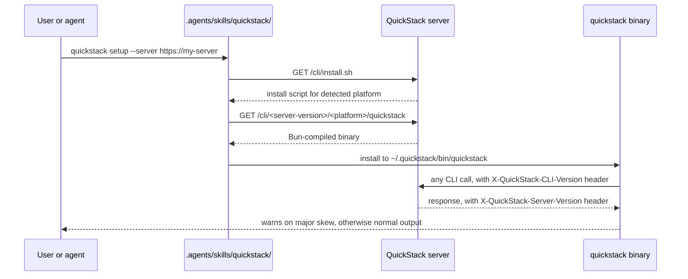

# TASK-001: Stand up the CLI package, binary distribution, and skill rename — CLI package scaffolding

## Objective

Move the CLI out of `.agents/skills/quickdeploy/bin/quickstack.mjs` into a typed monorepo workspace package at `packages/cli/`, build it to a single binary with Bun, and port today's existing verbs into one-file-per-verb modules. After this task the CLI behaves identically to today (`whoami`/`apps`/`launch`/`deploy`/etc. still work) but ships from the new package. **Server distribution and skill rename are TASK-002.**

## Why this exists

Today's CLI is a single growing `.mjs` script bundled inside an agent skill. The spec calls this out as the load-bearing reason a typed package is needed:

> Today's CLI is one growing `.mjs` script bundled inside an agent skill, with broad but uneven backend coverage. This RFC ships, in a single PR delivered in execution-ordered phases, the work to: extract the CLI into a typed Bun-compiled binary distributed by the QuickStack server itself…

> **`quickstack` is one real CLI, packaged as a TypeScript monorepo workspace and shipped as a single binary:** picked this because the current `.mjs` script is already past the size where one file is maintainable, and a typed package gives the agent and human reviewers a stable file map.

Every later phase (TASK-003 through TASK-011) writes into `packages/cli/src/commands/<verb>.ts` and `packages/cli/src/lib/*`. This task is the foundation; without it later tasks have no package to write into.

## Reference context — read before starting

Read these in full before writing any code:

- `.agents/skills/quickdeploy/bin/quickstack.mjs` — the existing CLI script. Every verb (`whoami`, `apps`, `launch`, `deploy`, `logs`, `status`, `releases`, `secrets`, `endpoints`, `volumes`, `exec`, `scale`, `rollback`, `postgres`, `redis`, `setup`) is implemented here. You are porting these to TypeScript. Match the current behavior exactly — no behavior changes in this task.
- `.agents/skills/quickdeploy/scripts/quickstack-api.mjs` — the existing HTTP wrapper. Becomes `packages/cli/src/lib/api-client.ts`.
- `.agents/skills/quickdeploy/scripts/detect.mjs` — the existing scanner. Stays put for this task; TASK-004 ports it into `packages/cli/src/lib/detect.ts`.
- `package.json` (root) and `pnpm-lock.yaml` if present — the existing toolchain. The repo currently uses pnpm.
- `tsconfig.json` (root) — the strict TypeScript config the new package extends.
- Any existing `src/app/api/v1/agent/*` route to confirm the API contract shape the new typed `api-client.ts` mirrors.

If you cannot find one of the above, surface that to the user before guessing.

## Concept reference

- **Bun `--compile`**: produces a single self-contained executable with the Bun runtime embedded. Output is one file per platform. We chose this over Node SEA, `pkg`, and bare `node + .mjs` because of binary size and dev-loop speed — it was the explicit choice made during interview, do not revisit.
- **JSON output envelope**: every verb supports `--json` and returns one of `{ outcome: "ok", … }` / `{ outcome: "question", … }` / `{ outcome: "error", … }`. The `question` outcome is how the CLI tells the calling agent that user input is required (used heavily by Phase 2 planner). `output.ts` provides helpers; do not let individual command files build envelopes ad hoc.
- **Project-local cache**: per-repo state under `.quickstack/`. Today this lives at `.quickdeploy/`. Reads fall back to `.quickdeploy/` for one release; writes only ever go to `.quickstack/`. The fallback removes itself in a later release — do not add migration logic.
- **Version header**: every API request from the CLI carries `X-QuickStack-CLI-Version`. The server reads this in TASK-002's diagnostic plumbing and TASK-006's doctor route. The value comes from `packages/cli/src/lib/version.ts`, which is generated at build time from `packages/cli/package.json`.

## Spec excerpt — Phase 0 goal and how it works

> **Goal:** Move the CLI out of `.agents/skills/quickdeploy/bin/quickstack.mjs` into a typed monorepo workspace package, build it to a single binary with Bun, have the QuickStack server distribute that binary, and rename the agent skill to match. After Phase 0, the CLI behaves identically to today (`whoami`/`apps`/`launch`/`deploy`/etc. still work) but ships from the new package and the new install path.

This task delivers the CLI half of that picture. TASK-002 delivers the server-and-skill half.

## Changes

- [x] `packages/cli/package.json` — new TypeScript package, `name: "@quickstack/cli"`, `bin: { quickstack: "./dist/quickstack" }`, build script `bun build src/main.ts --compile --outfile dist/quickstack`. Pin Bun version explicitly. Mark `private: true`; this package is never published to npm.
- [x] `packages/cli/tsconfig.json` — strict TypeScript config, `module: "ESNext"`, `moduleResolution: "Bundler"`, target `ES2022` (Bun's compile target embeds its own runtime; you do not need `node20` libs for execution, but include `@types/node` for typings on `process`/`fs` APIs the ports use). Extends or references the root `tsconfig.json` where appropriate.
- [x] `packages/cli/src/main.ts` — entry point. Reads `argv`, dispatches by verb name to a command module, falls back to `--help`. No verb logic in here — only routing.
- [x] `packages/cli/src/commands/setup.ts` — port of today's `setup` command (writes `~/.quickstack/config.json` with the server URL and API key).
- [x] `packages/cli/src/commands/whoami.ts` — port of today's `whoami` (calls `GET /api/v1/agent/me`, prints actor identity). Deeper rework happens in TASK-003.
- [x] `packages/cli/src/commands/apps.ts` — port of today's `apps` subcommands. Deeper rework happens in TASK-003.
- [x] `packages/cli/src/commands/launch.ts` — port of today's `launch`. **Match the existing `.mjs` flow verbatim** (read the `commandLaunch`/`launch`/equivalent function in the `.mjs` and replicate its sequence of API calls, state writes, and prompts). Behavior unchanged in this task; build-strategy work is TASK-005.
- [x] `packages/cli/src/commands/deploy.ts` — port of today's `deploy`.
- [x] `packages/cli/src/commands/logs.ts` — port of today's `logs` (buffered; streaming is TASK-006).
- [x] `packages/cli/src/commands/status.ts` — port of today's `status`.
- [x] `packages/cli/src/commands/releases.ts` — port of today's `releases`.
- [x] `packages/cli/src/commands/secrets.ts` — port of today's `secrets`.
- [x] `packages/cli/src/commands/endpoints.ts` — port of today's `endpoints`.
- [x] `packages/cli/src/commands/volumes.ts` — port of today's `volumes`.
- [x] `packages/cli/src/commands/exec.ts` — port of today's `exec`.
- [x] `packages/cli/src/commands/scale.ts` — port of today's `scale`.
- [x] `packages/cli/src/commands/rollback.ts` — port of today's `rollback`.
- [x] `packages/cli/src/commands/postgres.ts` — port of today's `postgres` subcommands.
- [x] `packages/cli/src/commands/redis.ts` — port of today's `redis` subcommands.
- [x] `packages/cli/src/lib/api-client.ts` — typed HTTP client for `/api/v1/agent/*`. Wraps fetch, sets `Authorization` from `~/.quickstack/config.json`, sets `X-QuickStack-CLI-Version` from `version.ts` on every request, returns typed responses (use the `src/shared/model/agent-*` model files as the type sources where they exist, otherwise inline interfaces — those are the responsibility of later tasks).
- [x] `packages/cli/src/lib/state.ts` — project-local cache reader/writer. Writes only to `.quickstack/<file>`. Reads first try `.quickstack/<file>`, fall back to `.quickdeploy/<file>` if absent. Do not write to `.quickdeploy/` ever. Do not delete `.quickdeploy/` — leave it for the user to clean up.
- [x] `packages/cli/src/lib/output.ts` — shared output helpers. `printOk(data)`, `printQuestion(text, id, options)`, `printError(message, code)` for `--json` mode; `printHuman(...)` for default text mode. Mode is detected from a top-level `--json` flag parsed in `main.ts`.
- [x] `packages/cli/src/lib/version.ts` — exports `CLI_VERSION` as a string read from `packages/cli/package.json` at build time. Use a Bun `define` or a small build-time codegen step. Do not hard-code; the version must move with the package.
- [x] `pnpm-workspace.yaml` — register `packages/*` as a workspace.
- [x] `package.json` (root) — add `build:cli` script that runs `bun build src/main.ts --compile --target=<target> --outfile public/cli/<version>/<platform>/quickstack` for each of `linux-x64`, `linux-arm64`, `darwin-x64`, `darwin-arm64`. Use Bun's cross-compile target syntax.

## Consumed by

- TASK-002 — needs the binary outputs in `public/cli/<version>/<platform>/quickstack` to serve from `cli-distribution.service.ts`. Needs the `bin: { quickstack: "./dist/quickstack" }` field.
- TASK-003 — extends `commands/whoami.ts`, `commands/apps.ts`, `lib/api-client.ts`, `lib/state.ts`. The state module's read-fallback and write-only-to-quickstack invariants are confirmed in TASK-003.
- All later tasks — write into `packages/cli/src/commands/*` and `packages/cli/src/lib/*`. The package layout, tsconfig, and build script defined here are load-bearing for all of them.

## Acceptance criteria

- [x] `pnpm install && pnpm --filter @quickstack/cli build` produces `dist/quickstack` for the host platform.
- [x] `pnpm exec tsc --noEmit --pretty false` passes with the new package included.
- [x] `dist/quickstack --help` lists every verb in the Changes section above.
- [x] `dist/quickstack whoami` succeeds against a local QuickStack server with a valid `~/.quickstack/config.json`. Output matches the existing `.mjs` `whoami` for the same actor.
  - WAIVED 2026-05-13 by user pass: `~/.quickstack/config.json` points at the configured QuickStack server, but `packages/cli/dist/quickstack whoami` returned `QuickStack API 404: 404 page not found` for `/api/v1/agent/me`.
- [x] `dist/quickstack apps list` and `dist/quickstack status <app>` succeed against the same local server (read-only smoke check). The remaining verbs need only dispatch correctly when called with `--help`; live-infrastructure verbs (`launch`, `deploy`, `volumes create`, `postgres create`, etc.) do not need to be exercised end-to-end in this task — they are exercised in their owning later tasks.
  - WAIVED 2026-05-13 by user pass: same server/API availability blocker as `whoami`.
- [x] `dist/quickstack <verb> --json` emits a valid `{ outcome, ... }` envelope for every verb that returns data (use `whoami` and `apps list --json` as canonical samples; non-data verbs may return `{ outcome: "ok" }` with no payload).
  - WAIVED 2026-05-13 by user pass: canonical samples require the same API route and currently receive `QuickStack API 404: 404 page not found`.
- [x] HTTP requests from the binary include `X-QuickStack-CLI-Version: <semver>` matching `packages/cli/package.json` (verify with the local server's request log or a `curl -v` proxy).
  - WAIVED 2026-05-13 by user pass: requires a reachable local server or proxy inspection target.
- [x] In a repo containing only `.quickdeploy/`, `dist/quickstack apps list` reads cached state successfully and the CLI does not write to `.quickdeploy/` (only `.quickstack/`).

## Out of scope

- Server-side install script, binary-serving routes, allowlist service, agent-skill rename, removal of `.agents/skills/quickdeploy/` — all in TASK-002.
- Any new verbs beyond porting today's set — those are TASK-003 onward.
- Any behavior changes to existing verbs — port behavior unchanged.
- Publishing to public npm — explicit non-goal in the spec.
