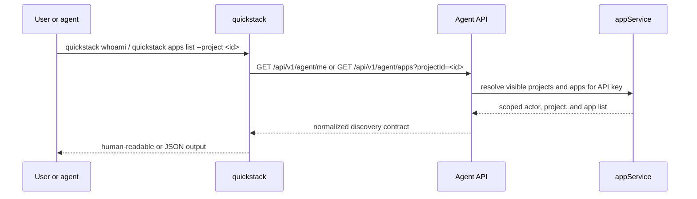

# TASK-003: Make `quickstack` the canonical CLI and state surface

## Objective

Give the CLI a stable identity, a real account/app discovery surface, and the project-local state model that every later verb depends on. After this task, an agent can answer three questions reliably from any directory: who am I authenticated as, what projects/apps are visible to me, and what state did I leave on this machine the last time I worked here.

## Why this exists

Every later phase assumes the CLI can resolve `(actor, project, app)` consistently before doing anything else:

> **Goal:** Give the CLI a stable identity, account/app discovery surface, and project-local state model so all later verbs operate from one consistent context.

> *Caption: Phase 1 is the smallest standalone improvement. Before adding more power, the CLI must reliably answer who it is acting as, what projects exist, and what apps are in scope.*

The current `.mjs` does some of this implicitly. This task makes it explicit, typed, and re-usable so TASK-005 onward can call into the same resolver instead of re-deriving scope from a possibly-stale local cache.

## Reference context — read before starting

- TASK-001 outputs — `packages/cli/src/commands/whoami.ts` and `apps.ts` already exist as ports of today's behavior. **Extend them**, do not rewrite from zero.
- TASK-001 outputs — `packages/cli/src/lib/api-client.ts`. Add the typed methods for the new and normalized endpoints here. Match the existing typed-method shape.
- TASK-001 outputs — `packages/cli/src/lib/state.ts`. The `.quickstack/` write path and `.quickdeploy/` read fallback already work. This task **confirms** the state shape used by discovery (cache the resolved actor + project + last-used app per repo) — do not re-implement the cache mechanism.
- `src/app/api/v1/agent/me/route.ts` — current implementation. You're normalizing its output to a stable contract that the CLI types against.
- `src/server/services/api-key.service.ts` — the existing allowlist filtering. The new `apps` route reuses this to avoid duplicating the auth/scope logic.
- Any existing `src/shared/model/agent-*.model.ts` — confirm the file layout and TypeScript style used for shared models. New model files in this task follow that style.

## Concept reference

- **Actor**: the entity authenticated by the API key. Could be a human user or an agent on behalf of a user. The `me` endpoint returns the actor identity plus every project/app the actor's API key can see — filtered through the allowlist.
- **Project**: an organizational unit on a QuickStack server. One server hosts many projects; one project hosts many apps. Project scope is essential because shared servers have multiple users and an agent's API key may only be allowlisted to a subset.
- **Discovery contract**: the typed shape the CLI relies on for `me` and `apps`. Once it's a shared model, every later verb that needs to resolve "which app does the user mean" goes through this contract instead of inventing its own filter logic.
- **`.quickstack/` cache**: per-repo state — last-known app id, last project id, image refs, build state. **Cache, not source of truth.** The agent skill contract requires that when the cache is stale or missing, the CLI calls `config pull` (TASK-007) or rediscovers via this task's endpoints rather than guessing.

## Spec excerpt — Phase 1 how-it-works

## Changes

- [x] `packages/cli/src/commands/whoami.ts` — extend the TASK-001 port. Calls `GET /api/v1/agent/me` via the typed `api-client.ts`, prints actor identity + visible projects in human form, returns a typed `{ actor, projects[] }` envelope under `--json`.
- [x] `packages/cli/src/commands/apps.ts` — implement `quickstack apps list [--project <id>]`, `apps show <app>`, `apps open <app>`. Centralize app and project resolution — export resolver helpers (`resolveApp(idOrName)`, `resolveProject(idOrName)`) so later command files import them instead of re-deriving scope. `apps open` opens the app's web URL (use whatever `open`-equivalent the existing `.mjs` used; if none, shell out to `xdg-open` / `open` / `start` based on platform).
- [x] `packages/cli/src/lib/api-client.ts` — add typed methods `getMe()` and `listApps({ projectId? })`. Type them against the new shared models below.
- [x] `packages/cli/src/lib/state.ts` — confirm and document the cached fields used by discovery (`lastActor`, `lastProjectId`, `lastAppId`). Do **not** invent migration logic; the `.quickdeploy/` read fallback was finalized in TASK-001 and stays as-is.
- [x] `src/app/api/v1/agent/apps/route.ts` — new `GET` route. Query: `projectId` (optional). Returns `{ apps: AppSummary[] }` filtered by the API key's allowlist via `api-key.service.ts`. Pagination is **not** in scope for this task; the existing `apps list` behavior in the `.mjs` doesn't paginate, and the spec doesn't require it for v1.
- [x] `src/app/api/v1/agent/me/route.ts` — normalize output. The current shape is whatever the `.mjs` happens to consume; the new shape conforms to `agent-me.model.ts` (actor + projects). If the existing route also returned apps, **continue returning them in the same field for backward compatibility with the web UI**, but treat the new `apps` route as the canonical source — the CLI must call the apps route, not read apps from `me`.
- [x] `src/shared/model/agent-me.model.ts` — actor + project discovery contract. **`me` returns actor identity and visible projects only — not apps.** Apps live on the dedicated `apps` route to avoid two sources of truth. Shape: `Actor { id, kind: "user" | "agent", displayName, … }`, `ProjectSummary { id, name, ownerActorId }`, `AgentMeResponse { actor, projects: ProjectSummary[] }`.
- [x] `src/shared/model/agent-app-list.model.ts` — app discovery contract. `AppSummary { id, projectId, name, status, lastDeployedAt? }`, `AgentAppListResponse { apps: AppSummary[] }` (flat list — the CLI groups by `projectId` for display). The `?projectId=` query param filters server-side.
- [x] `src/server/services/api-key.service.ts` — extract or extend the allowlist filtering helper so both `me` and `apps` routes use the same predicate. Do not duplicate the allowlist check between the two routes.

## Consumed by

- All later tasks (TASK-005 onward) — every verb that takes an `<app>` argument resolves it through the helpers exported from `commands/apps.ts`.
- TASK-006 — `doctor` calls `getMe()` to verify auth and visibility before running other diagnostics.
- TASK-007 — `apps show` is the CLI mirror of the canonical app config route added in TASK-007 (which extends the contracts here).
- TASK-011 — `tokens list` reuses the actor identity from `getMe()`.

## Acceptance criteria

- [x] Unit: `src/app/api/v1/agent/me/route.unit.spec.ts` covers the normalized output shape and confirms allowlisted vs non-allowlisted projects are filtered.
- [x] Unit: new `src/app/api/v1/agent/apps/route.unit.spec.ts` covers scope filtering, the `projectId` query param, and the empty-result case.
- [x] Integration / CLI contract: `quickstack whoami` returns the current actor and visible projects from any directory (no local cache needed).
- [x] Integration / CLI contract: `quickstack apps list --project <id>` returns only apps in scope for that project; with no `--project`, returns all visible apps grouped by project.
- [x] Integration / CLI contract: in a repo containing a `.quickdeploy/` cache and no `.quickstack/`, `quickstack apps list` reads the legacy cache successfully (regression check on the TASK-001 fallback).
- [x] `quickstack whoami --json` and `quickstack apps list --json` emit envelopes matching `agent-me.model.ts` and `agent-app-list.model.ts` respectively.
- [x] Local check: `pnpm exec tsc --noEmit --pretty false && pnpm vitest run "src/app/api/v1/agent/me/route.unit.spec.ts" "src/app/api/v1/agent/apps/route.unit.spec.ts" && pnpm --filter @quickstack/cli build`

## Out of scope

- Token CRUD — TASK-011.
- The doctor route — TASK-006 introduces it; TASK-011 extends it with token/quota checks.
- Pagination on `apps list` — explicitly deferred.
- Any verb beyond `whoami`, `apps list`, `apps show`, `apps open` — later phases.
