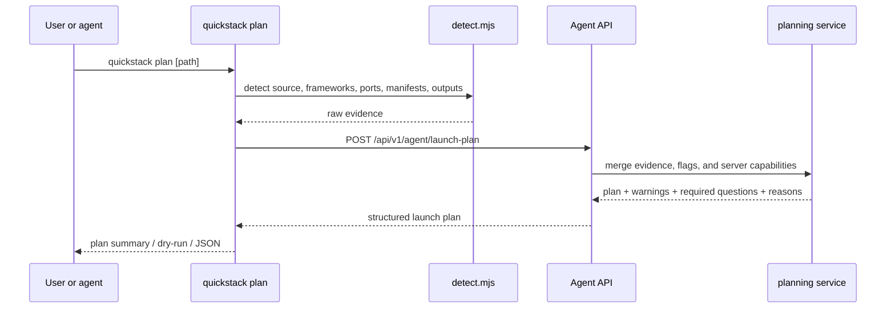

# TASK-004: Port the scanner into an evidence-first planner

## Objective

Convert source detection from hidden CLI behavior into a validated **plan** that explains what QuickStack inferred and what still needs user input. After this task, `quickstack plan [path]` emits a typed contract describing the framework, service root, port, output directory, recommended build strategies, and any open questions — without mutating any server state.

## Why this exists

Today's scanner runs inside `launch`/`deploy` and silently makes branching decisions. The spec promotes scanning into a first-class artifact:

> **Goal:** Convert source detection from hidden CLI behavior into a validated plan that explains what QuickStack inferred and what still needs user input.

> *Caption: Phase 2 makes detection legible. The scanner still runs locally, but it produces evidence that a planner turns into a normalized contract rather than a string of implicit branching decisions.*

The "scanner emits evidence, not decisions" rule is load-bearing for TASK-005's build-strategy work:

> The QuickStack-native rule is that the scanner never deploys and never creates server resources. It only emits evidence.

## Reference context — read before starting

- `.agents/skills/quickdeploy/scripts/detect.mjs` — today's scanner. **Port the logic** into `packages/cli/src/lib/detect.ts`. The current logic detects: runtime/framework family, Dockerfile presence (including overrides), static output directories (`dist`, `build`, `out`), Compose/Kubernetes manifests, port candidates. Read it before writing the TS port; do not reinvent the detection rules.
- TASK-003's outputs — `packages/cli/src/lib/api-client.ts`, the typed `getMe()` resolver, `commands/apps.ts` resolver helpers. The planner's `launch --plan` flow uses these to attach the plan to an actor/project context.
- TASK-001's outputs — `packages/cli/src/commands/launch.ts` and `deploy.ts`. Extend these with `--plan` / `--dry-run`; do not duplicate them.
- `src/app/api/v1/agent/apps/ensure/route.ts` — current implementation of "ensure an app exists, possibly creating it." This task extends it to accept the new plan contract as input, so the same code path serves CLI-driven and (eventually) web UI-driven app creation.
- Any existing `src/server/services/*.service.ts` — match the constructor/dependency-injection style for the new `quickdeploy-plan.service.ts`.

## Concept reference

- **Evidence**: a typed piece of source-level data the scanner observed — e.g. `"Dockerfile at ./Dockerfile"`, `"port 3000 from EXPOSE directive"`, `"output dir ./dist from vite config"`. Every inference the planner makes cites the evidence behind it so a reviewer (or agent) can audit the reasoning.
- **Service root**: the subdirectory of the repo that contains the deployable service. For monorepos this is non-obvious — the scanner reports its best guess plus a question if multiple roots are plausible.
- **Plan**: the planner's normalized output. Contains: framework, service root, ports, recommended build strategies (priority-ordered), required follow-up questions (when ambiguous), warnings (when something looks risky but is not blocking).
- **Required follow-up question**: a typed `{ id, prompt, options? }` returned in the plan when the planner cannot safely decide. The CLI surfaces these to the user/agent via the `outcome: "question"` JSON envelope from `output.ts` (TASK-001).
- **`--plan` vs `--dry-run`**: both produce a plan and exit without mutation. `--plan` is canonical and produces the full structured plan; `--dry-run` is shorthand for the same behavior on `launch`/`deploy` invocations to support agent ergonomics.

## Spec excerpt — Phase 2 how-it-works and scanner port

> Required scanner behaviors: runtime and framework family detection (with version hints where safe), Dockerfile detection (including explicit override), static output detection (`dist`, `build`, `out`, and framework-specific outputs), service-root detection for monorepos, port detection from Dockerfile/framework defaults/manifests/explicit config, database or service-desire hints when the layout strongly implies managed Postgres or Redis, builder hints when source shape suggests one backend, evidence output for every inference.
>
> Required scanner outputs: scanner family and framework, service root, evidence list with source path and reason, likely build entrypoint(s), likely output directory, raw endpoint candidates, recommended build strategies in priority order, required follow-up questions.

## Changes

- [x] `packages/cli/src/lib/detect.ts` — port `detect.mjs` to TypeScript. Add typed evidence outputs covering all the required scanner behaviors above. Each inference carries `{ kind, sourcePath, reason }`. The function returns the raw evidence; it does **not** decide build strategy itself (that's the planner's job).
- [x] `packages/cli/src/commands/plan.ts` — new `commandPlan()`. Runs `detect.ts`, posts the evidence to `POST /api/v1/agent/launch-plan`, prints the returned plan in human-readable form or as a JSON envelope. Open questions surface via `outcome: "question"`.
- [x] `packages/cli/src/commands/launch.ts` — add `--plan` and `--dry-run`. Both produce the same plan output as `quickstack plan` and exit with code 0 without calling `ensure`/`upload-build`/`deploy`. Without those flags, behavior unchanged in this task (build-strategy selection lands in TASK-005).
- [x] `packages/cli/src/commands/deploy.ts` — add `--plan` and `--dry-run` with the same semantics as `launch`.
- [x] `packages/cli/src/lib/api-client.ts` — add typed `postLaunchPlan(evidence): Promise<AgentLaunchPlan>` method.
- [x] `src/app/api/v1/agent/launch-plan/route.ts` — new `POST` route. Accepts the typed evidence payload, calls `quickdeploy-plan.service.ts`, returns the typed plan. No server-state mutation.
- [x] `src/server/services/quickdeploy-plan.service.ts` — the planner. Inputs: evidence from the CLI, optional user flags, current server capabilities. Outputs: plan + warnings + required questions + reasons for each inference. Inference rules are explicit and testable; the unit test below pins them.
- [x] `src/shared/model/agent-launch-plan.model.ts` — typed contract. At minimum: `Evidence { kind, sourcePath, reason }`, `BuildStrategyRecommendation { strategy: "source-tar" | "local-docker" | "existing-image" | "remote-builder", reason, priority }`, `PlanQuestion { id, prompt, options? }`, `PlanWarning { code, message }`, `AgentLaunchPlan { framework, serviceRoot, ports, outputDir?, evidence: Evidence[], buildStrategies: BuildStrategyRecommendation[], questions: PlanQuestion[], warnings: PlanWarning[] }`.
- [x] `src/app/api/v1/agent/apps/ensure/route.ts` — extend to accept an optional `plan: AgentLaunchPlan` field on the request body. When present, the route uses the plan's `framework`/`serviceRoot`/`ports`/`outputDir` instead of expecting the CLI to send those ad hoc. Backward-compatible — without the `plan` field, current behavior is preserved.

## Consumed by

- TASK-005 — the `BuildStrategyRecommendation[]` returned here is the input to TASK-005's build-strategy resolver. TASK-005 is where a recommendation actually becomes a deploy.
- TASK-007 — `quickstack image deploy` (which deploys an existing image without a fresh scan) uses the same plan contract with a synthetic single-strategy plan.

## Acceptance criteria

- [x] Unit: `src/server/services/quickdeploy-plan.service.unit.spec.ts` covers at least: a Dockerfile repo, a static-output repo (e.g., Vite/Next), an existing-image repo (no source, `--image` flag), and an ambiguous multi-service monorepo. Each case asserts the recommended strategy ordering and any questions surfaced.
- [x] Integration: `src/app/api/v1/agent/launch-plan/route.unit.spec.ts` covers required-questions outputs, capability-failure outputs (e.g., remote-builder requested but unavailable), and a happy-path plan with a Dockerfile.
- [x] CLI contract: `quickstack plan ./fixtures/<repo>` prints a structured plan in human form and a typed envelope under `--json`. Ambiguous repos surface `outcome: "question"`.
- [x] CLI contract: `quickstack launch --plan ./fixtures/<repo>` and `quickstack deploy --plan ./fixtures/<repo>` produce identical plan output and do not mutate server state.
- [x] Web-UI source-setup screen (if it consumes `/launch-plan`) continues to render without regression — the contract is additive.
- [x] Pass criterion: `pnpm exec tsc --noEmit --pretty false && pnpm vitest run "src/server/services/quickdeploy-plan.service.unit.spec.ts" "src/app/api/v1/agent/launch-plan/route.unit.spec.ts" && pnpm --filter @quickstack/cli build`

## Out of scope

- Actually applying a build strategy — TASK-005.
- Persisting plans server-side — plans are ephemeral; the route takes evidence and returns a plan, full stop.
- Web UI changes — additive contract only.
- Database-desire hints driving service attachment — TASK-010 handles that downstream; here you only emit the hint as a `PlanWarning` or as part of the recommendations.
