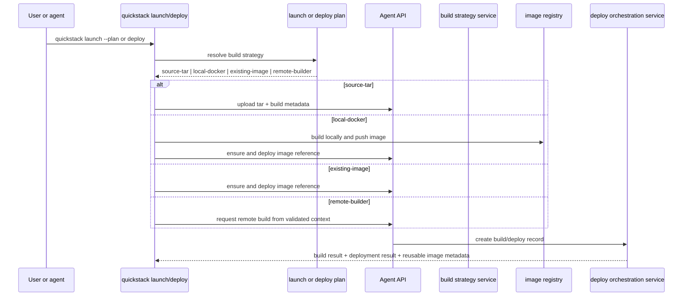

# TASK-005: Port the image, build, and deployer model

## Objective

Make build strategy a first-class concept. The CLI and server choose, then expose, the fastest valid build path — `source-tar`, `local-docker`, `existing-image`, or `remote-builder` — instead of treating source tar uploads as the default for almost everything. Every backend produces the same normalized build result so later phases (status, releases, rollback) do not care how the image was built.

## Why this exists

The spec calls fast deploys impossible without explicit strategy:

> **Goal:** Let QuickStack choose and expose the fastest valid build path instead of treating source tar uploads as the default managed path for almost everything.

> **Build strategy is a first-class product concept:** picked this because fast deploys do not come from one transport. Different repos and environments should flow into source tar uploads, local Docker build/push, existing images, or remote builder paths for explicit reasons.

> *Caption: Phase 3 is the fast-deploy phase. The scanner and planner no longer imply one transport; they select an explicit build backend and a normalized deployer contract that the CLI and server both understand.*

The "normalized result regardless of backend" rule is what makes TASK-006 (rollout watch) and TASK-007 (releases) feasible:

> Every build path must emit the same normalized build result contract so later deploy, release, and status flows do not care how the image was produced.

## Reference context — read before starting

- `.agents/skills/quickdeploy/bin/quickstack.mjs` — find `packageManagedSource()` (or its current name). This is the monolithic source-tar function being replaced. Read it fully; the `source-tar` build strategy in this task is the typed/refactored version of its behavior.
- TASK-001 outputs — `packages/cli/src/commands/launch.ts`, `deploy.ts`. The `--build-strategy` flag plugs into them.
- TASK-001 outputs — `packages/cli/src/lib/api-client.ts`. Add typed methods for the new build orchestration route.
- TASK-004 outputs — `src/shared/model/agent-launch-plan.model.ts`'s `BuildStrategyRecommendation`. The CLI feeds the planner's recommendation into the resolver here as the default strategy when `--build-strategy auto` (or unset).
- `src/app/api/v1/agent/apps/[appId]/upload-build/route.ts` — current tar upload route. Keeps working, but its response now conforms to the shared build result contract introduced here.
- `src/app/api/v1/agent/apps/[appId]/deploy/route.ts` — current deploy route. Extended to accept normalized build/image results from any strategy.
- Whatever existing `src/server/services/build.service.ts` and any upload service do today — match their patterns; the new strategy/upload services follow the same shape.

## Concept reference

- **Build strategy**: an enum of how the image gets produced. Four members:
  - `source-tar`: today's behavior. CLI tars the repo, uploads to the server, server builds.
  - `local-docker`: CLI invokes the local Docker daemon, builds, pushes to the registry the QuickStack server is configured to use, then tells the server "deploy this image ref."
  - `existing-image`: no build at all — the user/agent passes an image ref, the server deploys it.
  - `remote-builder`: server-backed build from a validated context (the CLI uploads context metadata, a remote builder service does the build). Stub-quality is acceptable in this task if a remote builder is not yet available — the **route, contract, and CLI flag** must exist; the actual builder backend can be a TODO that returns "not configured."
- **Normalized build result contract**: `{ image: { registry, repository, digest, tag? }, strategy, sourceProvenance, cacheHit, sizeBytes? }`. Every strategy produces this shape so `deploy` and `releases` consume it uniformly.
- **Cache reuse**: when source/image inputs are unchanged, repeated deploys should reuse the prior image rather than forcing a new upload/build. The strategy resolver consults the server for "what image is currently associated with this content hash" before picking a strategy.
- **Backend capability check**: not every server supports every strategy. `local-docker` requires registry credentials reachable by the CLI; `remote-builder` requires the server to have a builder configured. The resolver asks the server (via `quickdeploy-build-strategy.service.ts`) what's available before recommending.

## Spec excerpt — Phase 3 how-it-works and required deployer behaviors

> Required build features across those strategies: explicit build args and build secret support, Dockerfile override support, target-stage selection when a Dockerfile defines multiple targets, cache-aware repeated deploy behavior, normalized build result contract regardless of backend, consistent image provenance and content-hash tracking, consistent release metadata so later `status`, `releases`, and `rollback` flows do not care how the image was produced.
>
> Required deployer behaviors: explicit deployment ids and release ids, release records regardless of build origin, wait/watch support with rollout-state transitions, structured warnings when a strategy cannot satisfy a requested deploy mode, normalized deploy summaries usable by both humans and agents, strategy-aware deploy messages, rollback records that appear in the same release history as forward deploys.

## Changes

- [x] `packages/cli/src/commands/launch.ts` and `packages/cli/src/commands/deploy.ts` — add `--build-strategy auto|source-tar|local-docker|existing-image|remote-builder`. Default `auto` consults the resolver. Also add `--image <ref>` (forces `existing-image`), `--dockerfile <path>` (overrides detected Dockerfile), `--build-arg KEY=VAL` (repeatable), `--target <stage>`.
- [x] `packages/cli/src/commands/build.ts` — new top-level `quickstack build [path] [--build-strategy ...]` verb. Produces a build result and prints it without deploying. Useful for an agent that wants to inspect cache behavior or hand the result off to a separate deploy invocation.
- [x] `packages/cli/src/lib/build-strategies/source-tar.ts` — backend executor for source-tar. Replaces the source-tar half of today's `packageManagedSource()`.
- [x] `packages/cli/src/lib/build-strategies/local-docker.ts` — backend executor for local Docker. Invokes local `docker` (use child_process; do not vendor a Docker SDK), builds with build args / target / Dockerfile override, pushes to the registry the server is configured to use (the server returns the registry URL + push credentials when the resolver reports `local-docker` is available).
- [x] `packages/cli/src/lib/build-strategies/existing-image.ts` — backend executor for `--image`. No build; just normalizes the user-supplied image ref into the build result contract.
- [x] `packages/cli/src/lib/build-strategies/remote-builder.ts` — backend executor for remote builder. CLI uploads validated context (file list + content hashes), calls `POST /apps/[appId]/builds` with `kind: "remote-builder"`, polls for completion. If the server reports the builder isn't configured, the executor returns a clear error.
- [x] `packages/cli/src/lib/build-strategies/index.ts` — resolver. Inputs: planner recommendation, user `--build-strategy` flag, server capabilities (fetched once via the api-client). Output: chosen executor + reasoning string. Cache hits short-circuit to `existing-image` with the prior image ref.
- [x] `packages/cli/src/lib/api-client.ts` — typed methods: `getBuildCapabilities(appId)`, `uploadBuildTar(appId, tarStream, metadata)`, `createBuild(appId, payload)`, `deployImage(appId, buildResult)`.
- [x] `src/app/api/v1/agent/apps/[appId]/upload-build/route.ts` — keep tar upload support, normalize the response into the shared build result contract.
- [x] `src/app/api/v1/agent/apps/[appId]/builds/route.ts` — new build orchestration route. `POST` accepts `{ kind: "local-docker-finalize" | "remote-builder", ... }` plus the metadata required for that kind. Returns the same build result contract.
- [x] `src/app/api/v1/agent/apps/[appId]/deploy/route.ts` — extend to accept a normalized `buildResult` payload from any strategy, instead of inferring it from a tar upload. Existing tar-driven callers continue to work via the upload route handing off internally.
- [x] `src/server/services/quickdeploy-build-strategy.service.ts` — strategy selection, cache reuse, backend capability checks. Exposes `getCapabilities()`, `resolveForApp(appId, recommendation, userFlag)`, `recordBuildResult(appId, result)`.
- [x] `src/server/services/quickdeploy-upload.service.ts` — normalize build metadata across all four strategies. The single source of truth for what a build result looks like.
- [x] `src/server/services/build.service.ts` — deepen build and release normalization so a deploy from any strategy produces a release record indistinguishable from another, downstream.
  - Covered by normalized buildResult handoff into the existing `buildAndDeploy` deployment path; no separate build.service edit was required.
- [x] `src/shared/model/agent-build-strategy.model.ts` — typed contract. `BuildStrategy` enum, `BuildResult { image: ImageRef, strategy, sourceProvenance, cacheHit, sizeBytes? }`, `ImageRef { registry, repository, digest, tag? }`, `BuildCapabilities { strategies: BuildStrategy[], registry?: { url, pushCredentials? }, remoteBuilder?: boolean }`.

## Consumed by

- TASK-006 — `releases` and `status` consume the normalized build result + release record. The Phase 4 work depends on every release looking the same regardless of how it was built.
- TASK-007 — `image show` reads the live image ref from the build result; `image deploy` is `existing-image` strategy with a synthetic build.
- TASK-006's rollback semantics — releases produced here are the rows rollback travels across.

## Acceptance criteria

- [x] Unit: `src/server/services/quickdeploy-build-strategy.service.unit.spec.ts` covers strategy resolution from each combination of (planner recommendation × user flag × server capability), fallback when the requested strategy is unavailable, cache-hit short-circuit to `existing-image`, and invalid combinations.
- [x] Integration: route specs for `upload-build` (tar path), `builds` (local-docker-finalize and remote-builder paths), and `deploy` (consuming a normalized build result).
- [x] Manual verification: deploy one sample app with `--build-strategy source-tar`, one with `--build-strategy local-docker`, and one with `--image <ref>`. Then re-run each deploy and verify the second invocation reports `cacheHit: true` and reuses image metadata instead of forcing a new upload/build.
  - WAIVED 2026-05-13 by user pass: requires live app deploys, Docker/registry access, and reachable server credentials.
- [x] `quickstack deploy --build-strategy remote-builder` against a server that does not have a remote builder configured returns a clear, structured error (not a stack trace) that includes the remediation "remote builder is not configured on this server." The route, contract, and CLI flag are present and tested; the actual remote build backend is allowed to be a TODO.
- [x] Pass criterion: `pnpm exec tsc --noEmit --pretty false && pnpm vitest run "src/server/services/quickdeploy-build-strategy.service.unit.spec.ts" "src/app/api/v1/agent/apps/[appId]/upload-build/route.unit.spec.ts" "src/app/api/v1/agent/apps/[appId]/builds/route.unit.spec.ts"`

## Out of scope

- Implementing the actual remote builder backend — stub is acceptable provided the route, contract, and clear "not configured" error path exist.
- Rollout watch / `--wait` — TASK-006.
- Release history UI — release records are produced here; rendering is TASK-006/TASK-007.
- Multi-stage Dockerfile auto-detection beyond `--target` — surface as a planner question (TASK-004), not a resolver branch.
