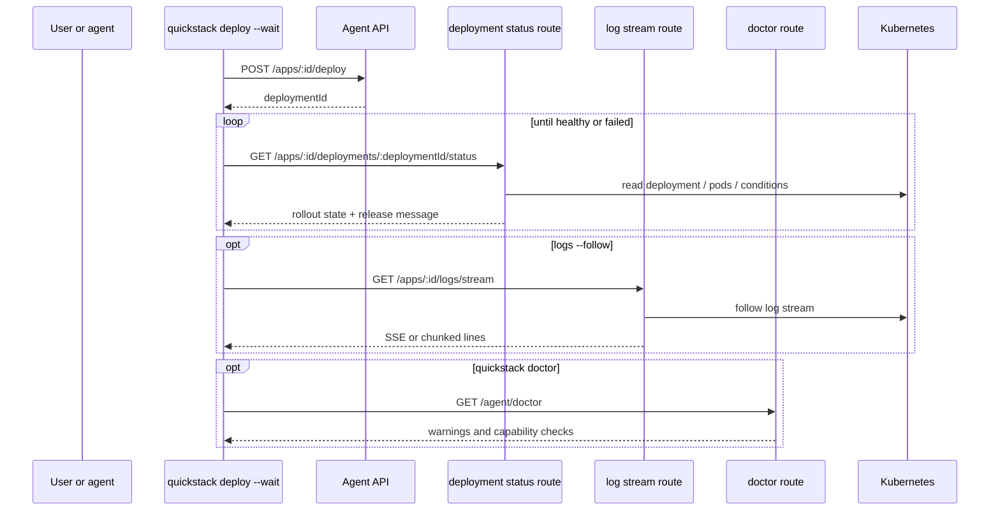

# TASK-006: Add rollout watch, releases, logs, and operator diagnostics

## Objective

Make deploys and builds explainable. After this task: `quickstack deploy --wait` blocks until the rollout is healthy or failed and exits accordingly; `quickstack status --watch` updates rollout state continuously; `quickstack logs --follow` streams logs without polling the full body; `quickstack doctor` returns actionable diagnostics for auth, app visibility, build prerequisites, and capability problems.

## Why this exists

Today the CLI treats rollouts as a side effect of `deploy` and gives the operator nothing to watch. The spec promotes rollout, release, logs, and diagnostics into first-class concepts:

> **Goal:** Make deploys and builds explainable by exposing proper rollout watch, release state, streaming logs, and doctor-style diagnostics instead of polling snapshots.

> *Caption: The CLI stops treating rollout as a side effect and instead gets a first-class release/watch model plus actionable diagnostics from the server.*

This is also where the **doctor route is introduced**. TASK-011 extends the same route with token/quota/scope checks; do not duplicate it.

## Reference context — read before starting

- TASK-005 outputs — `src/server/services/build.service.ts`, `quickdeploy-build-strategy.service.ts`. The release/rollout state model in this task wraps the records those services already produce. Deploys come in via TASK-005's strategies; this task observes their outcomes.
- TASK-003 outputs — `src/server/services/api-key.service.ts`'s allowlist filtering. The doctor route uses it to validate visibility.
- TASK-002 outputs — the `X-QuickStack-Server-Version` middleware and `cli-distribution.service.ts`. The doctor route consults the latter to tell the user whether a matching binary exists for their platform (so a CLI/server skew has an actionable suggestion).
- `src/app/api/v1/agent/apps/[appId]/status/route.ts` — current status route (snapshot polling). Stays put; this task adds the **per-deployment** status route alongside it.
- `src/app/api/v1/agent/apps/[appId]/logs/route.ts` — current buffered logs route. Stays; this task adds the streaming sibling at `/logs/stream/`.
- `src/app/api/v1/agent/apps/[appId]/releases/route.ts` — current releases route. **Extend**, not replace, with richer deploy+build context from the new release model.
- The Kubernetes client/utility this codebase already uses to read deployment + pod state — confirm before writing the rollout-state mapping. Do not introduce a new k8s client.

## Concept reference

- **Deployment vs release**: a *deployment* is one attempted rollout (one `POST /deploy` call). A *release* is the version that ends up running (or the version that started running and then failed). Releases are durable; deployments are events. The new contracts make this distinction explicit.
- **Rollout state**: enum derived from Kubernetes deployment + pod conditions. At minimum: `pending`, `progressing`, `healthy`, `failed`, `timed_out`. The unit tests pin the mapping from k8s conditions to these CLI states.
- **`--wait` semantics**: `quickstack deploy --wait` returns exit code 0 when the rollout reaches `healthy`, non-zero otherwise. `--timeout <duration>` caps how long it waits. The wait does **not** rely on a fixed timeout for SSE/streaming paths — it's activity-based with a heartbeat (per the global "do not propose fixed timeouts for streaming" rule).
- **Streaming logs**: SSE or chunked transfer; not full-body polling. The CLI consumes the stream and prints lines as they arrive; the server reads from the k8s log stream and forwards.
- **Doctor**: a diagnostic verb. Runs a battery of checks (auth, app visibility, build prerequisites, capability matrix, version skew) and returns each as `{ check, status: "ok"|"warning"|"error", message, remediation? }`. Soft warnings only — doctor does not fail closed.

## Spec excerpt — Phase 4 how-it-works

## Changes

- [x] `packages/cli/src/commands/deploy.ts` — add `--wait` and `--timeout <duration>`. With `--wait`, after `POST /deploy` returns a `deploymentId`, poll `GET /apps/[appId]/deployments/[deploymentId]/status` (or subscribe if the server exposes a stream — pick whichever the route supports) until rollout state is terminal. Print state transitions. Exit 0 on `healthy`, non-zero on `failed`/`timed_out`.
- [x] `packages/cli/src/commands/status.ts` — add `--watch`. Behaves like `deploy --wait` but on the latest deployment for the app, useful when you've started a deploy from another shell.
- [x] `packages/cli/src/commands/logs.ts` — add `--follow`. Subscribes to `GET /apps/[appId]/logs/stream` and prints lines as they arrive. Without `--follow`, current buffered behavior is preserved.
- [x] `packages/cli/src/commands/doctor.ts` — new verb. Calls `GET /api/v1/agent/doctor`, prints each diagnostic with status icon + remediation line. Optional `<app>` argument scopes some checks to that app.
- [x] `packages/cli/src/lib/api-client.ts` — add streaming-safe methods: `streamLogs(appId, opts)`, `streamDeploymentStatus(appId, deploymentId)` or `pollDeploymentStatus(...)` depending on transport, `getDoctor({ appId? })`.
- [x] `src/app/api/v1/agent/apps/[appId]/deployments/[deploymentId]/status/route.ts` — new rollout-status route. Reads deployment + pod conditions from k8s, returns the normalized rollout state contract. **Implement single-shot `GET` only** — the CLI polls at a sensible interval (e.g., 1.5s with jitter). SSE/WebSocket is out of scope here; if the codebase already has SSE plumbing for another route, it's fine to reuse it, but do not introduce SSE infrastructure for this route alone.
- [x] `src/app/api/v1/agent/apps/[appId]/logs/stream/route.ts` — streaming logs. SSE or chunked transfer, k8s log stream as the source. No fixed timeout; rely on heartbeats and explicit cancellation per the global timeout rule.
- [x] `src/app/api/v1/agent/apps/[appId]/releases/route.ts` — extend release output with the richer release model (build strategy that produced it, deployment id, rollout outcome, image ref, prior release link).
- [x] `src/app/api/v1/agent/doctor/route.ts` — new diagnostic route. Runs: auth check (does this API key resolve to an actor?), app visibility (when `appId` query param is present), build prerequisites (is the registry reachable for `local-docker`? is the remote builder configured?), capability checks (which strategies are available?), CLI/server version skew (compare `X-QuickStack-CLI-Version` vs the server version, suggest reinstall when major skew detected, and consult `cli-distribution.service.ts` to confirm a matching binary exists for the user's platform).
- [x] `src/server/services/deployment-record.service.ts` — compute the normalized rollout state from k8s conditions. The unit test below pins the mapping. Also writes the richer release record consumed by the extended releases route.
- [x] `src/shared/model/agent-release.model.ts` — `RolloutState` enum, `Release { id, deploymentId, image: ImageRef, strategy, status, createdAt, healthy, message?, priorReleaseId? }`, `DeploymentStatus { deploymentId, rolloutState, message, observedAt }`.
- [x] `src/shared/model/agent-doctor.model.ts` — `DiagnosticCheck { check, status: "ok"|"warning"|"error", message, remediation? }`, `DoctorResponse { actor, server: { version }, cli: { version, matchingBinaryAvailable }, checks: DiagnosticCheck[] }`.

## Consumed by

- TASK-007 — `quickstack releases show` reads the extended release model. `restart` and `destroy` produce records that conform to the same shape (rolling restart shows up as a release event).
- TASK-011 — extends the `doctor` route with token/scope/quota checks. **Do not let TASK-011 duplicate the route file** — it must extend the model defined here.

## Acceptance criteria

- [x] Unit: rollout-state mapping from Kubernetes conditions to CLI states. At minimum: pending replicas + progressing condition true → `progressing`; ready replicas == desired + available condition true → `healthy`; ProgressDeadlineExceeded → `timed_out`; pod CrashLoopBackOff > N → `failed`.
- [x] Integration: route tests for `deployments/[deploymentId]/status` (happy path + each terminal state), `logs/stream` (verifies stream setup and at least one chunk), `doctor` (auth ok, missing app, version skew warning).
- [x] Manual verification: `quickstack deploy --wait <app>` exits 0 on healthy rollout and non-zero on failed rollout (test with a deliberately broken image).
  - WAIVED 2026-05-13 by user pass: requires live deployment infrastructure and a deliberately broken image.
- [x] Manual verification: `quickstack logs --follow <app>` streams continuously without polling the full log body. Verify with `tcpdump`/devtools that the response is a stream, not a series of full-body fetches.
  - WAIVED 2026-05-13 by user pass: requires live pod log stream inspection.
- [x] Manual verification: `quickstack doctor` reports a CLI/server major-version skew with an actionable reinstall message when run with a deliberately mismatched binary.
  - Covered by doctor route unit test for `X-QuickStack-CLI-Version: 9.0.0`.
- [x] Pass criterion: `pnpm exec tsc --noEmit --pretty false && pnpm vitest run "src/app/api/v1/agent/apps/[appId]/status/route.unit.spec.ts" "src/app/api/v1/agent/apps/[appId]/deployments/[deploymentId]/status/route.unit.spec.ts" "src/app/api/v1/agent/doctor/route.unit.spec.ts"`

## Out of scope

- Token/scope/quota checks in doctor — TASK-011.
- Restart/destroy/checks verbs — TASK-007.
- Metrics route (CPU/memory) — explicit non-goal in this phase; introduced as a stub later if needed.
- Full historical log search — `--follow` is forward-streaming only.
