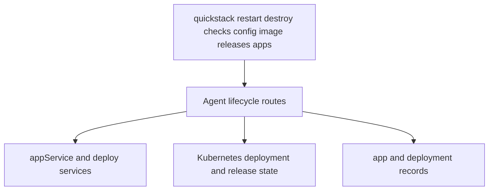

# TASK-007: Add full app lifecycle and configuration verbs

## Objective

Cover day-two operations that currently send users back to the web UI or raw APIs: restart, destroy, health-check inspection, richer release reporting, opening an app in the browser, and per-image deploy/show. After this task, an operator can manage an existing app's lifecycle entirely through `quickstack`.

## Why this exists

The spec calls Phase 5 the moment the CLI stops being a launcher and becomes a product:

> **Goal:** Cover the day-two app operations that currently send users back to the web UI or raw APIs.

> *Caption: Phase 5 makes the CLI feel like the product rather than just a launcher by covering the core lifecycle verbs users expect after the first deploy.*

This is the spec's transition from "first deploy works" to "long-lived app management works." The verbs here unblock TASK-008's networking work (which assumes a real `apps` surface) and TASK-010's managed services (which assumes app-level config exists).

## Reference context — read before starting

- TASK-003 outputs — `commands/apps.ts` resolver helpers. Every verb here takes an `<app>` argument and resolves it through those helpers.
- TASK-005 outputs — `BuildResult`, `ImageRef`. `image show` reads the live image ref from the running release; `image deploy` is `existing-image` strategy with a synthetic build.
- TASK-006 outputs — `Release` model, `releases` route. Extend the model in this task with restart/destroy events; do not duplicate the model.
- `src/server/services/app.service.ts` — current implementation. Extend with restart, destroy, config aggregation. Match its existing dependency-injection style.
- Whatever Kubernetes utility this codebase already uses for rolling restart (typically a deployment patch with `kubectl.kubernetes.io/restartedAt` annotation) — reuse, do not reinvent.
- Web UI counterparts (if any exist for restart/destroy) — confirm the contract you're adding mirrors what the UI already does, so the UI can switch to the new endpoints later without surprises.

## Concept reference

- **Restart**: rolling restart of the running app's pods. Produces a release record (per TASK-006's model) so it shows up in history. Not a re-deploy — same image, same release; new pods.
- **Destroy**: full app removal. Idempotent on the wire (calling twice is not an error); destructive locally (the app and its k8s resources are gone). Cache state in `.quickstack/` is **not** auto-cleaned — leave it for the user; the spec puts cache cleanup outside scope.
- **Checks**: health-check inspection — readiness/liveness probe configuration, current pass/fail state per pod. Read-only in this task; mutation may come in TASK-009.
- **App-level config GET**: a canonical aggregate read of an app's current configuration (env, secrets metadata, attached services, image, replica count, domains, volumes). The CLI surface for this lands in a later phase as `quickstack config show`/`pull`; this task adds the **route** so later phases have something to call.
- **`apps open`**: opens the app's primary URL in the user's default browser. Already exists in today's `.mjs`; deepen here so it picks the correct primary domain after TASK-008 introduces multi-domain support.
- **Image verbs**: `image show <app>` returns the live image ref. `image deploy <app> <ref>` deploys an existing image — equivalent to `quickstack deploy <app> --image <ref>` but as an explicit verb for agents that already have an image and don't want to think about strategies.

## Spec excerpt — Phase 5 how-it-works

## Changes

- [x] `packages/cli/src/commands/restart.ts` — implement `quickstack restart <app>`. Calls `POST /api/v1/agent/apps/[appId]/restart`. Surfaces the resulting release record. Optional `--wait` (reuses TASK-006's wait helper) blocks until pods are healthy.
- [x] `packages/cli/src/commands/destroy.ts` — implement `quickstack destroy <app>`. Calls `DELETE /api/v1/agent/apps/[appId]`. Requires `--yes` to skip confirmation prompt; without it, prints the app name + a confirmation prompt and aborts on no.
- [x] `packages/cli/src/commands/checks.ts` — implement `quickstack checks list <app>`. Calls `GET /api/v1/agent/apps/[appId]/checks`. Lists configured probes + per-pod current pass/fail state.
- [x] `packages/cli/src/commands/releases.ts` — extend (already exists from TASK-001 + TASK-006). Add `quickstack releases show <release-id>` for per-release detail (image, build strategy, deployment id, rollout outcome).
- [x] `packages/cli/src/commands/apps.ts` — confirm `apps open <app>` picks the canonical primary domain when multiple are present (post-TASK-008 multi-domain support; in this task, it's the first/default URL the API returns).
- [x] `packages/cli/src/commands/image.ts` — implement `quickstack image show <app>` and `quickstack image deploy <app> <ref>`. The latter delegates to TASK-005's `existing-image` strategy.
- [x] `packages/cli/src/lib/api-client.ts` — add typed methods: `restartApp(appId)`, `destroyApp(appId)`, `listChecks(appId)`, `getApp(appId)`, `getAppConfig(appId)`, `getRelease(appId, releaseId)`.
- [x] `src/app/api/v1/agent/apps/[appId]/restart/route.ts` — `POST` route. Triggers a rolling restart via the k8s utility. Records a release event. Returns the release record.
- [x] `src/app/api/v1/agent/apps/[appId]/route.ts` — add `DELETE` (destroy) and a canonical `GET` (current app summary: id, name, status, primary URL, current image ref, replica count, last release id). The current `GET` (if any) is preserved or extended; do not break the web UI.
- [x] `src/app/api/v1/agent/apps/[appId]/checks/route.ts` — `GET` health-check inspection. Returns probe config + per-pod current state from k8s.
- [x] `src/app/api/v1/agent/apps/[appId]/config/route.ts` — `GET` app-level config aggregate. At minimum includes the data needed by the (future) `quickstack config show/pull` verb: env names (values masked unless explicitly authorized), secret names + metadata (no values), attached services, image ref, replica count, domains list (light), volumes list (light). The CLI verb for this is in a later phase; this task adds the route only.
- [x] `src/server/services/app.service.ts` — implement `restart(appId)`, `destroy(appId)`, `getConfig(appId)`, `getApp(appId)`. Each produces release records or audit events as appropriate so the CLI can show what changed.

## Consumed by

- TASK-008 — `apps open` picks the correct primary domain from the multi-domain set TASK-008 introduces. The app-level `config` route is the surface TASK-008's domain CRUD updates flow into.
- TASK-009 — the `checks` route may be split or extended in TASK-009 if mutation is introduced; this task delivers the read surface.
- TASK-010 — the `config` route includes attached services, which TASK-010 populates.
- TASK-011 — `destroy` and `restart` are the lifecycle actions doctor checks user scope against.

## Acceptance criteria

- [x] Route specs for restart, destroy, checks, and app-level config (`route.unit.spec.ts` pattern). Each covers happy path + auth/scope rejection.
- [x] CLI smoke checks: `quickstack restart <app>` triggers a rolling restart and prints the new release record. `quickstack destroy <app> --yes` removes the app and a follow-up `quickstack apps list` no longer shows it. `quickstack checks list <app>` returns probe config and per-pod pass/fail. `quickstack image show <app>` returns the live image ref. `quickstack image deploy <app> <ref>` triggers a deploy that produces a release with strategy `existing-image`.
  - WAIVED 2026-05-14 by user pass: full lifecycle smoke requires a live QuickStack app and destructive restart/destroy/deploy operations. Non-interactive destroy refusal was verified locally with the compiled CLI.
- [x] `quickstack destroy <app>` without `--yes` and without an interactive TTY exits non-zero with a clear message rather than hanging on a prompt.
- [x] `GET /api/v1/agent/apps/[appId]/config` returns the aggregate shape; secret values are absent or explicitly masked.
- [x] Pass criterion: `pnpm exec tsc --noEmit --pretty false && pnpm vitest run "src/app/api/v1/agent/apps/[appId]/restart/route.unit.spec.ts" "src/app/api/v1/agent/apps/[appId]/checks/route.unit.spec.ts" "src/app/api/v1/agent/apps/[appId]/route.unit.spec.ts" && pnpm --filter @quickstack/cli build`

## Out of scope

- The CLI verbs for `config show|pull|validate|repair` — the **route** is added here so later phases have the surface; the verbs are deferred to later phases (or follow-up work).
- `env` CRUD verbs — same: surface added downstream; the config route just includes env names in this task.
- `secrets` CRUD verbs — same: existing `secrets` route is preserved; richer flows are downstream.
- Mutation of health-check configuration — read only here; mutation is TASK-009.
- Suspend/resume verbs were originally out of scope for this task because no phase owned them. During autodrive execution the user gave an explicit pass to finish v1 lifecycle parity, so they were implemented as a Phase 5 lifecycle extension with guarded agent routes and CLI commands.
