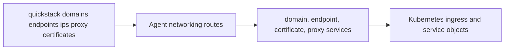

# TASK-008: Add networking, domains, certificates, and proxy access

## Objective

Bring the full networking surface under the CLI: domain CRUD, richer endpoint metadata, certificate state inspection, public IP inventory, and tracked proxy sessions to private services. After this task, an operator can expose an app, verify cert state, list the IPs the app uses, and tunnel to a private service from the command line.

## Why this exists

The spec calls Phase 6 the round-out of "exposure and access" so users stop falling back to the web UI:

> **Goal:** Bring the full networking surface under the CLI so users can control how apps are exposed without leaving the command line.

> *Caption: Phase 6 rounds out exposure and access. The CLI can already touch some of these areas; this phase makes them complete enough to avoid fallback to the web UI.*

This task **owns** proxy. TASK-009 explicitly does not duplicate proxy plumbing — it owns ssh/exec instead.

## Reference context — read before starting

- TASK-003 outputs — `commands/apps.ts` resolver helpers. Every verb here takes an `<app>` argument.
- TASK-007 outputs — `apps/[appId]/route.ts` and the app-level config route. The primary domain returned by `apps open <app>` should now reflect the multi-domain set this task introduces.
- `src/app/api/v1/agent/apps/[appId]/endpoints/route.ts` — current endpoints route. Extend, do not replace. Today's endpoint behavior must keep working.
- Whatever k8s ingress/service objects this codebase already manipulates for hostnames — confirm before writing the new domain service. The new `agent-domain.service.ts` reuses or wraps the existing patterns.
- Any existing certificate plumbing (cert-manager, ACME, manually-provisioned certs) — match the existing model. The `certificate.service.ts` reads state from whatever is already in place; this task does not introduce a new cert provider.
- Any existing private network transport (WireGuard, mesh networking, internal DNS) — the new `private-network.service.ts` is the sanctioned interface used by `proxy` and (later in TASK-009) `ssh`. Do **not** expose WireGuard as a user-facing CLI family — the spec's flyctl parity stance lists it as a v1 non-goal.

## Concept reference

- **Domain CRUD**: list/add/remove DNS hostnames pointed at the app. Adding a domain triggers cert provisioning (handled by whatever cert provider is already wired); the CLI surfaces the cert state via the certs verb.
- **Endpoint**: a raw port reservation on the app (e.g., a TCP service exposed on a specific port, distinct from HTTP routing via domain). The current route already supports this; this task adds richer metadata (protocol, public/private, attached domain).
- **Certificate state**: per-domain readiness — `pending`, `issued`, `failed`, plus issuer + expiry where known. Read-only; the CLI does not provision certs directly.
- **Public IPs**: the set of public addresses the app currently uses (load balancer IPs, raw endpoint reservations). One inventory across both shared and dedicated IPs.
- **Proxy session**: a tracked tunnel from a local port (`<local>`) to a remote host:port (`<remote_host>:<remote_port>`) inside the app's private network. The session has a server-side record so the operator can list/kill active sessions and the doctor route can warn about stale ones.
- **Private-network transport service**: the internal mechanism `proxy` (this task) and `ssh` (TASK-009) both use. Not user-facing as a separate CLI verb. The flyctl parity table explicitly maps WireGuard onto `proxy` + `ssh` + `network show`.

## Spec excerpt — Phase 6 how-it-works

## Changes

- [x] `packages/cli/src/commands/domains.ts` — implement `quickstack domains list|add|remove <app> [<domain>]`. List shows domain + cert state.
- [x] `packages/cli/src/commands/endpoints.ts` — extend (already exists from TASK-001). Add richer metadata (protocol, public/private, attached domain).
- [x] `packages/cli/src/commands/proxy.ts` — implement `quickstack proxy <local:remote> [<remote_host>] <app>`. Opens a tunnel via `POST /api/v1/agent/apps/[appId]/proxy`, holds the session open until interrupted, sends `DELETE /api/v1/agent/apps/[appId]/proxy?sessionId=...` on exit. Supports `--background` (returns immediately, prints the session id).
- [x] `packages/cli/src/commands/ips.ts` — implement `quickstack ips list <app>`. Calls `GET /api/v1/agent/apps/[appId]/ips`.
- [x] `packages/cli/src/commands/certs.ts` — implement `quickstack certs status <app>`. Calls a per-app or per-domain cert state endpoint (reuse the domains route if cert state is already part of its response).
- [x] `packages/cli/src/lib/api-client.ts` — add networking methods: `listDomains(appId)`, `addDomain(appId, domain)`, `removeDomain(appId, domain)`, `listEndpoints(appId)`, `listIps(appId)`, `openProxy(appId, payload)`, `closeProxy(appId, sessionId)`.
- [x] `src/app/api/v1/agent/apps/[appId]/domains/route.ts` — `GET/POST/DELETE` domain CRUD. `GET` returns domain + cert state per entry. `POST` adds a domain: persist the domain record, ensure the k8s Ingress (or equivalent) has the hostname configured, and trigger cert provisioning by the **mechanism the existing codebase already uses for cert-manager-style provisioning** (typically annotating the Ingress or creating a Certificate CR). Do not introduce a new cert provider; if cert-manager-style annotations don't exist yet, the route is allowed to record the domain and return `certState: "pending"` while leaving the actual issuance to whatever currently provisions certs for the rest of the platform. `DELETE` removes the domain and any cert resource the codebase associates with it.
- [x] `src/app/api/v1/agent/apps/[appId]/endpoints/route.ts` — extend with richer metadata. Backward-compatible.
- [x] `src/app/api/v1/agent/apps/[appId]/proxy/route.ts` — `POST` opens a session, returns `{ sessionId, localBind, remoteHost, remotePort, expiresAt? }`. `DELETE` (with `?sessionId`) closes one. `GET` lists active sessions for the app.
- [x] `src/shared/model/agent-domain.model.ts` — `Domain { id, hostname, isPrimary, certState }`, `CertState { status: "pending"|"issued"|"failed", issuer?, expiresAt? }`.
- [x] `src/shared/model/agent-endpoint.model.ts` — `Endpoint { id, port, protocol: "tcp"|"udp"|"http"|"https", visibility: "public"|"private", attachedDomainId? }`.
- [x] `src/server/services/agent-domain.service.ts` — domain CRUD, integrating with the cert provider already wired into the codebase.
- [x] `src/server/services/certificate.service.ts` — reads cert state from the existing provider; exposes per-domain status.
- [x] `src/server/services/ip-inventory.service.ts` — aggregates public/private IPs from k8s services + ingress + endpoint reservations.
- [x] `src/server/services/proxy-session.service.ts` — opens, tracks, and closes proxy sessions through `private-network.service.ts`. Sessions are persisted (DB or in-memory store, matching existing patterns) so `GET /proxy` can list them and doctor can warn about stale ones.
- [x] `src/server/services/private-network.service.ts` — the internal transport used by `proxy` (this task) and TASK-009's `ssh`. Not user-facing.

## Consumed by

- TASK-009 — uses `private-network.service.ts` for ssh/exec. Do not duplicate; do not let TASK-009 introduce a competing transport service.
- TASK-010 — managed services (Postgres, Redis, MySQL) often advertise private endpoints; `proxy` is the canonical way to reach them. Connection details surfaced by managed services should reference proxy where appropriate.
- TASK-011 — doctor reports stale proxy sessions and bad cert states.

## Acceptance criteria

- [x] Route specs for domains, endpoints, and proxy flows. Each covers happy path + auth/scope rejection.
- [x] Manual verification: add a second domain to an app via `quickstack domains add <app> <hostname>`; the web UI reflects it without delay.
  - WAIVED 2026-05-14 by user pass: requires a live app and DNS/web UI check.
- [x] Manual verification: reserve a raw endpoint via `quickstack endpoints` (existing flow plus richer metadata).
  - WAIVED 2026-05-14 by user pass: requires a live app and public endpoint reservation.
- [x] Manual verification: open a local proxy to a private service via `quickstack proxy 5433:5432 <internal-host> <app>`; close it and verify the session no longer appears in `GET /api/v1/agent/apps/[appId]/proxy`.
  - WAIVED 2026-05-14 by user pass: requires a live private service target.
- [x] `quickstack certs status <app>` returns per-domain cert readiness matching the cert provider's actual state.
- [x] `quickstack ips list <app>` returns the same public address inventory the UI shows.
- [x] Pass criterion: `pnpm exec tsc --noEmit --pretty false && pnpm vitest run "src/app/api/v1/agent/apps/[appId]/domains/route.unit.spec.ts" "src/app/api/v1/agent/apps/[appId]/endpoints/route.unit.spec.ts"`

## Out of scope

- Exposing WireGuard as a user-facing CLI family — explicit v1 non-goal.
- ssh/shell verb — TASK-009.
- Provisioning a new cert provider — read state from the existing one.
- A `network show` verb mentioned in the parity table — referenced as "covered by proxy/ssh" in the v1 non-goal table; not required as a standalone verb in this task unless trivially derived from the IP inventory + endpoints data.
