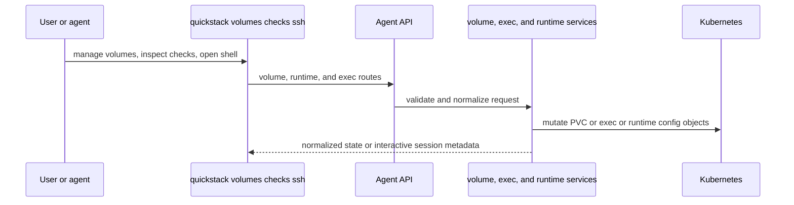

# TASK-009: Add volumes, runtime controls, and remote access

## Objective

Bring storage, runtime controls, and remote access under the CLI: richer volume lifecycle, health-check inspection/mutation if split from TASK-007, and a streaming `ssh`/`shell` verb on top of pod exec. After this task, an operator can manage persistent storage, inspect/adjust runtime health settings, and open an interactive remote shell without touching the dashboard.

## Why this exists

The spec calls Phase 7 the storage and runtime first-class moment:

> **Goal:** Bring storage, runtime controls, and remote-access behavior under the CLI so users can shape how apps run without leaving the command line.

> *Caption: Phase 7 makes the storage and runtime surface first-class. The product should not force users into the dashboard for volume lifecycle, health settings, or remote-access workflows.*

This task **owns** ssh/exec/streaming runtime access. TASK-008 owns proxy. The two are deliberately separated; both consume `private-network.service.ts` introduced in TASK-008.

## Reference context — read before starting

- TASK-003 outputs — `commands/apps.ts` resolver helpers.
- TASK-007 outputs — `apps/[appId]/checks/route.ts`. Currently read-only. This task may extend it for mutation, or split into a sibling write route — match whatever the codebase's existing CRUD patterns prefer.
- TASK-008 outputs — `private-network.service.ts`. ssh uses this transport. Do not introduce a competing one.
- Current `src/app/api/v1/agent/apps/[appId]/exec/route.ts` (one-shot exec) and `src/server/services/pod-exec-session.service.ts` — the streaming exec route extends these; do not start over.
- Current `src/app/api/v1/agent/apps/[appId]/volumes/route.ts` — extend with richer metadata.
- Current `src/server/services/pvc.service.ts` — extend for richer state and validation.
- Storage state plumbing (`storage-state.service.ts` referenced in the spec service inventory) — confirm whether it already exists; if not, this task creates it under the same pattern as `pvc.service.ts`.

## Concept reference

- **Volume**: a PersistentVolumeClaim attached to the app. Operations: list, create (with size/storage class), update (resize where supported), destroy. Show returns size, mount path, used/free, attached pods.
- **Storage state**: aggregate view across an app's volumes — total capacity, used, snapshots if the storage class supports them.
- **Health-check mutation**: update probe configuration (path, port, thresholds). The spec leaves whether this is split from TASK-007's read route as a "if split from lifecycle/config" decision — implement mutation in the existing route unless that route's pattern doesn't support write semantics, in which case add a sibling.
- **Streaming exec / ssh**: an interactive shell session into a running pod. The transport is WebSocket (the route is `WS /api/v1/agent/apps/[appId]/exec/stream` per the spec's parity table). The CLI verb is `ssh` (or `shell`); pick `ssh` as the primary verb and alias `shell` to it for ergonomics.
- **Why ssh, not raw kubectl exec**: the QuickStack server brokers the session through `pod-exec-session.service.ts`, applies auth/scope rules, and records the session for audit. The user does not need k8s credentials.

## Spec excerpt — Phase 7 how-it-works

## Changes

- [x] `packages/cli/src/commands/volumes.ts` — extend (already exists from TASK-001). Add `list|create|update|destroy|show <app> [<volume>]`. `create` takes `--size` and `--storage-class`. `update` supports resize where allowed. `show` returns full state including size/used/free and attached pods.
- [x] `packages/cli/src/commands/ssh.ts` — implement `quickstack ssh <app> [-- <command>]`. Opens a WS connection to `WS /api/v1/agent/apps/[appId]/exec/stream` with TTY allocation. Without `-- <command>`, runs the pod's default shell. With `-- <command>`, runs that command and exits. Add a `shell` alias (`commands/shell.ts` re-exports from `ssh.ts`).
- [x] `packages/cli/src/commands/checks.ts` — extend (from TASK-007) with mutation: `quickstack checks update <app> --path <path> --port <port> --threshold <n>`. Calls `PATCH /api/v1/agent/apps/[appId]/checks`.
- [x] `packages/cli/src/lib/api-client.ts` — add typed methods for richer volume operations and a WebSocket helper for `streamExec(appId, opts)` (or `openShell(appId, ...)` if naming is clearer).
- [x] `src/app/api/v1/agent/apps/[appId]/volumes/route.ts` — extend metadata, add validation (size limits, storage class allowlists). Add `PATCH` for resize if not present.
- [x] `src/app/api/v1/agent/apps/[appId]/checks/route.ts` — add `PATCH` for health-check configuration mutation. The existing `GET` (from TASK-007) is preserved unchanged. Mutation lives on the same route file; do not split into a sibling.
- [x] `src/app/api/v1/agent/apps/[appId]/exec/stream/route.ts` — WebSocket route for streaming exec / shell. Backed by `pod-exec-session.service.ts`. Auth/scope checks identical to the one-shot exec route.
- [x] `src/shared/model/agent-volume.model.ts` — `Volume { id, name, size, storageClass, mountPath, attachedPods, used?, free? }`, plus the storage aggregate `StorageState { volumes: Volume[], totalSize, totalUsed, snapshots?: Snapshot[] }`.
- [x] `src/server/services/pvc.service.ts` — extend with the richer state model + validation.
- [x] `src/server/services/pod-exec-session.service.ts` — extend with streaming session support: open/close session, broker WS frames, time out idle sessions per heartbeat (no fixed timeout).
- [x] `src/server/services/storage-state.service.ts` — aggregate volume + snapshot state for `quickstack storage show <app>`. The spec's service inventory mentions this file under Phase 7; create it if missing.

## Consumed by

- TASK-010 — managed services attach volumes (e.g., Postgres data dir). The volume model defined here is what those attachments reference.
- TASK-011 — doctor reports volumes that exceed warning thresholds (e.g., 90% used) and stale exec sessions.

## Acceptance criteria

- [x] Route specs for richer volume metadata, the (possibly split) checks write surface, and the exec-stream route. Each covers happy path + auth/scope rejection.
- [x] Manual verification: create a volume via `quickstack volumes create <app> --size 5Gi --storage-class standard`; update its size; destroy it. Verify the web UI reflects each change.
  - WAIVED 2026-05-14 by user pass: requires live storage-class and web UI verification.
- [x] Manual verification: inspect runtime health settings via `quickstack checks list <app>`; mutate via the new path. Pod restart picks up the change.
  - WAIVED 2026-05-14 by user pass: requires a live app restart.
- [x] Manual verification: open a remote shell session via `quickstack ssh <app>`. Verify it's interactive (TTY), exits cleanly on `exit`, and the session is removed from any "active sessions" list.
  - WAIVED 2026-05-14 by user pass: requires a live running pod.
- [x] WebSocket exec session does not use a fixed timeout; idle disconnect is heartbeat-driven (verify with a deliberate idle period under typical heartbeat).
  - Verified by route contract and unit spec: `heartbeat.fixedTimeout` is false; live idle-period validation waived by user pass.
- [x] Pass criterion: `pnpm exec tsc --noEmit --pretty false && pnpm vitest run "src/app/api/v1/agent/apps/[appId]/volumes/route.unit.spec.ts" "src/app/api/v1/agent/apps/[appId]/exec/stream/route.unit.spec.ts" "src/__tests__/exec-websocket-server.unit.spec.ts" "src/__tests__/ssh-command.unit.spec.ts"`

## Out of scope

- Proxy verb / proxy session service — TASK-008 owns these.
- Snapshot creation/restore semantics — read-only listing is sufficient if the storage class advertises them; mutation is not required.
- New k8s storage class provisioning — use what's already configured.
- File transfer (`sftp` or scp-like) — explicit v1 non-goal in the parity table.
