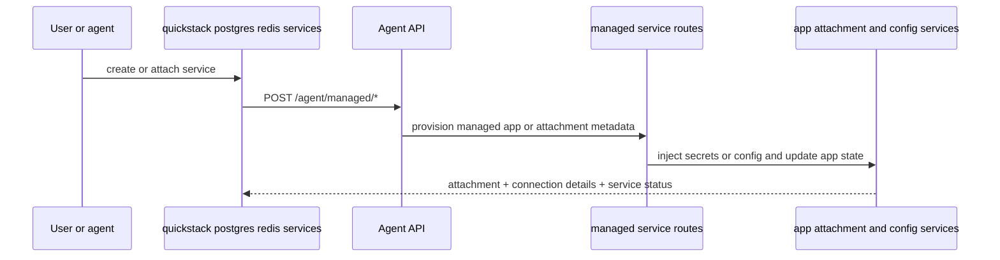

# TASK-010: Deepen managed services and app composition

## Objective

Make managed services part of the same deployment product, not a side workflow. After this task: deeper Postgres/Redis attachment + status flows, MySQL added as a first-class family under the same shared contract, and a `services` composition verb that lists/attaches/detaches services on an app. Config pull (TASK-007 route) reflects attached services consistently.

## Why this exists

The spec calls out service composition as a load-bearing piece of "app as a unit":

> **Goal:** Make managed services feel like part of the same deployment product, not just isolated side commands.

> *Caption: Phase 8 turns managed databases and managed services into part of the same app-composition workflow as launch and deploy, rather than side commands with fragmented state.*

The shared `agent-managed-service.model.ts` is the linchpin: every managed service family (Postgres, Redis, MySQL, future) goes through it, so the CLI never grows family-specific code paths for status/attachment.

## Reference context — read before starting

- TASK-003 outputs — `commands/apps.ts` resolver helpers.
- TASK-007 outputs — `apps/[appId]/config/route.ts`. Attached services show up here. After this task, `quickstack config show` (when added) reflects attachments without code changes here.
- TASK-008 outputs — `private-network.service.ts` and proxy. Connection details surfaced by managed services should reference proxy as the canonical access path for private endpoints.
- Current `src/app/api/v1/agent/managed/postgres/route.ts` and `redis/route.ts` — extend with status and attachment metadata. Existing create/list/destroy behavior must keep working.
- Current `src/server/services/quickstack-managed-service.ts`, `postgres.service.ts`, `redis.service.ts` — extend, do not replace. Match their patterns when introducing `mysql.service.ts` and `service-attachment.service.ts`.
- Whatever managed-service provisioning mechanism this codebase already uses for Postgres/Redis (operator, Helm chart, custom k8s resource) — use the same for MySQL. Do not introduce a new provisioning mechanism.

## Concept reference

- **Managed service**: a service the QuickStack server provisions and manages on behalf of a project (Postgres, Redis, MySQL). Different from app-level dependencies; managed services are first-class objects with their own status, lifecycle, and connection details.
- **Attachment**: an association between an app and a managed service. Attaching injects connection details into the app's config (typically as env vars / secrets) and updates the app's `config show` output. Detaching removes the injection.
- **Shared managed-service contract**: one TypeScript model (`agent-managed-service.model.ts`) covers Postgres, Redis, MySQL, and future families. Per-family routes use the same model — adding a new family is "create the route + service file, reuse the model."
- **Service composition verb**: `quickstack services list|attach|detach|status` operates across families. Not a replacement for the per-family verbs; a higher-level alternative for agents that want to reason about service composition without caring which kind.
- **Config reflection**: when a service is attached/detached, `apps/[appId]/config` updates. The CLI does not need a separate "refresh config" call — the route is computed each time.

## Spec excerpt — Phase 8 how-it-works

## Changes

- [x] `packages/cli/src/commands/postgres.ts` — extend (already exists from TASK-001). Deepen `create|list|attach|destroy|status`. `attach` takes `--app <app>` and injects connection details; `status` returns the shared managed-service status shape.
- [x] `packages/cli/src/commands/redis.ts` — same extensions as postgres.
- [x] `packages/cli/src/commands/mysql.ts` — new file. Same surface as postgres/redis, using the same shared contract.
- [x] `packages/cli/src/commands/services.ts` — new top-level composition verb. `services list <app>` shows attached services across all families; `services attach <app> <service-id>` attaches; `services detach <app> <service-id>` detaches; `services status <service-id>` returns the shared status.
- [x] `packages/cli/src/lib/api-client.ts` — normalize managed-service result contracts. Typed methods: `listManaged(family)`, `createManaged(family, payload)`, `destroyManaged(family, id)`, `getManagedStatus(family, id)`, `attachService(appId, serviceId)`, `detachService(appId, serviceId)`, `listAttachedServices(appId)`.
- [x] `src/app/api/v1/agent/managed/postgres/route.ts` — extend status and attachment metadata to conform to the shared model.
- [x] `src/app/api/v1/agent/managed/redis/route.ts` — same as postgres.
- [x] `src/app/api/v1/agent/managed/mysql/route.ts` — new route mirroring postgres/redis surface (`GET/POST/DELETE`).
- [x] `src/app/api/v1/agent/managed/services/route.ts` — `GET` lists attachments scoped to an app or project. Used by `services list`.
- [x] `src/app/api/v1/agent/managed/services/attach/route.ts` — `POST` attaches a service to an app.
- [x] `src/app/api/v1/agent/managed/services/detach/route.ts` — `POST` detaches.
- [x] `src/shared/model/agent-managed-service.model.ts` — shared contract. `ManagedServiceFamily` enum (`postgres`|`redis`|`mysql`), `ManagedService { id, family, name, status: "provisioning"|"healthy"|"degraded"|"failed", connection: { hostname, port, secretRefs?: string[] }, createdAt, ... }`.
- [x] `src/shared/model/agent-service-attachment.model.ts` — `ServiceAttachment { serviceId, appId, attachedAt, injectedEnvKeys: string[], injectedSecretKeys: string[] }`. Used by `services list` and the config aggregate.
- [x] `src/server/services/quickstack-managed-service.ts` — deepen with the shared contract; route handlers for each family delegate normalization here.
- [x] `src/server/services/postgres.service.ts` — extend status/attachment behavior to match the shared contract.
- [x] `src/server/services/redis.service.ts` — same as postgres.
- [x] `src/server/services/mysql.service.ts` — new file, same shape.
- [x] `src/server/services/service-attachment.service.ts` — handles attach/detach semantics: injecting env/secret refs into the app, updating attachment records, removing on detach. The single source of truth for what "attached" means.

## Consumed by

- TASK-007's existing `apps/[appId]/config` route — already pulls attached services, so it reflects this task's attachments without code changes here. Verify in this task.
- TASK-011 — doctor reports unhealthy attached services and quota issues for managed services.

## Acceptance criteria

- [x] Route specs for create, attach, and destroy flows for at least Postgres and Redis (the spec's pass criterion). MySQL route spec is recommended but not pinned by the criterion command.
- [x] Manual verification: create a managed Postgres service via `quickstack postgres create <project>`, attach it to an app via `quickstack postgres attach <service> --app <app>`, then `quickstack config show <app>` (or `GET /api/v1/agent/apps/[appId]/config`) reflects the attachment and the injected env/secret keys.
  - WAIVED 2026-05-14 by user pass: live managed-service provisioning and app config verification requires deployment.
- [x] Manual verification: same flow for Redis and MySQL — confirms the shared contract works across families.
  - WAIVED 2026-05-14 by user pass: live managed-service provisioning requires deployment.
- [x] `quickstack services list <app>` returns the union of attachments across families.
- [x] `quickstack postgres status <service>`, `quickstack redis status <service>`, `quickstack mysql status <service>` return identical shape conforming to `agent-managed-service.model.ts`.
- [x] Pass criterion: `pnpm exec tsc --noEmit --pretty false && pnpm vitest run "src/app/api/v1/agent/managed/postgres/route.unit.spec.ts" "src/app/api/v1/agent/managed/redis/route.unit.spec.ts"`

## Out of scope

- Adding service families beyond Postgres/Redis/MySQL — explicit non-goal in the parity table (`extensions` family is non-goal).
- A new managed-service provisioning mechanism — reuse what already provisions Postgres/Redis.
- LiteFS Cloud / `lfsc` style — explicit v1 non-goal.
