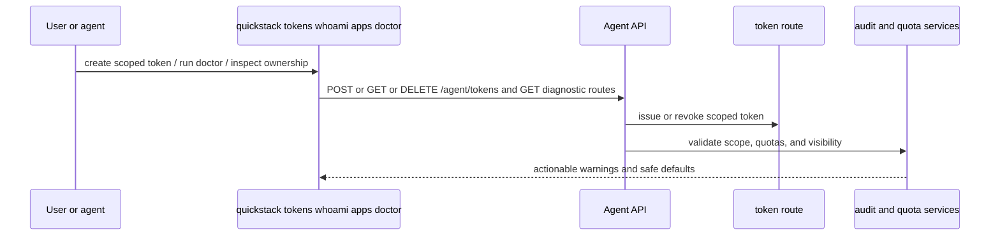

# TASK-011: Add multi-user safety, tokens, and agent ergonomics

## Objective

Make the CLI safe and understandable on shared servers where multiple people and multiple agents act on the same infrastructure. After this task: `quickstack tokens list|create|revoke` manages scoped CLI tokens; the doctor route (introduced in TASK-006) is extended with token-scope, quota, and ownership checks; CLI denial/error output is clear and actionable so an agent never has to guess why a call was rejected.

## Why this exists

The spec's "shared server with friends and agents" framing is the entire point of v1:

> **Goal:** Make the CLI safe and understandable on shared servers where many people and many agents are acting on the same infrastructure.

> *Caption: Phase 9 makes the product fit the actual target environment: shared servers where agents need strong scopes, clear diagnostics, predictable failure messages, and explicit operational guardrails.*

The doctor route here **extends** the one introduced in TASK-006 — do not duplicate the route file. The shared model `agent-doctor.model.ts` is also extended, not redefined.

## Reference context — read before starting

- TASK-003 outputs — `commands/apps.ts` resolver helpers, `agent-me.model.ts`. The actor identity returned by `getMe()` is the basis for token ownership.
- TASK-006 outputs — `src/app/api/v1/agent/doctor/route.ts` and `src/shared/model/agent-doctor.model.ts`. **Extend both.** The Phase 4 doctor already handles auth/visibility/build prerequisites/capabilities/version skew. This task adds token-scope, quota, and ownership checks to the same route and model.
- TASK-010 outputs — managed-service quota signals (per-family limits) feed into the new quota checks.
- TASK-008 outputs — proxy session inventory feeds into "stale session" warnings.
- Current `src/server/services/api-key.service.ts` — extend with token lifecycle (issue, list, revoke). Match the existing API-key persistence model; the spec calls token CRUD a "lifecycle endpoint" rather than a brand-new auth mechanism — they're scoped variants of the API key system already in place.
- Whatever quota/audit service exists today (or is implied by the spec's "any quota or audit services" wording) — check what's already in the codebase before creating new files.

## Concept reference

- **Token**: a scoped CLI credential. Differs from an API key in that it's CLI-issued (a user runs `quickstack tokens create`), is scoped (project, app, or actor-wide), and is revocable from the CLI. Implementation may be a tagged subset of API keys; the spec is pragmatic about reuse.
- **Scope**: what a token can touch. Minimum: `actor` (the issuer's full visibility), `project: <id>` (one project), `app: <id>` (one app). Future scopes are out of scope for v1.
- **Quota**: per-actor or per-project limits — number of apps, total volume size, managed services per family. Doctor reports current usage vs limits and warns when approaching.
- **Ownership in errors**: when a CLI call is denied, the error message must say *what* was denied and *why* — "app `myapp` is in project `team-a` which is not in your token's scope" rather than "permission denied."
- **Soft, never hard**: doctor warns and reports; it does not block calls. The version-skew handling in TASK-006 set this precedent and TASK-011 follows it for token/quota issues.

## Spec excerpt — Phase 9 how-it-works

## Changes

- [x] `packages/cli/src/commands/tokens.ts` — new verb. `tokens list` shows all tokens issued by the current actor (id, scope, issued at, last used, prefix only — never the full token). `tokens create [--scope project:<id>|app:<id>|actor]` issues a new token and prints the full value once (with a "save this; it will not be shown again" notice). `tokens revoke <token-id>` revokes.
- [x] `packages/cli/src/commands/doctor.ts` — extend (already exists from TASK-006). Add token/scope/quota result rendering. Each new check follows the existing `DiagnosticCheck { check, status, message, remediation? }` shape.
- [x] `packages/cli/src/lib/output.ts` — extend `printError` to render the structured ownership/scope context when it's present in an error payload. Today's `printError(message, code)` becomes `printError({ message, code, scope?, ownership? })`. Backward-compatible call sites kept working.
- [x] `packages/cli/src/lib/api-client.ts` — add `listTokens()`, `createToken({ scope })`, `revokeToken(tokenId)`, `getDoctor({ appId? })` (already exists from TASK-006 — confirm it still typechecks against the extended doctor model).
- [x] `src/app/api/v1/agent/tokens/route.ts` — `GET/POST/DELETE` token CRUD. Backed by `api-key.service.ts` extensions. `POST` returns the full token value once; subsequent `GET` only returns a prefix.
- [x] `src/app/api/v1/agent/doctor/route.ts` — **extend** the Phase 4 route with token-scope, quota, and ownership checks. Do not create a second doctor route.
- [x] `src/shared/model/agent-token.model.ts` — `Token { id, scope, prefix, issuedAt, lastUsedAt?, issuedByActorId, expiresAt? }` (where `prefix` is the first 8–12 chars of the token followed by `…`, never the full secret), `TokenScope = "actor" | { project: string } | { app: string }`.
- [x] `src/shared/model/agent-doctor.model.ts` — extend with token, scope, and quota result fields. The existing `DiagnosticCheck` shape covers the rendering; add per-check `code` constants for the new checks (e.g., `"token.expired"`, `"quota.apps"`, `"quota.volumes"`).
- [x] `src/server/services/api-key.service.ts` — extend with `issueToken(actor, scope)`, `listTokens(actor)`, `revokeToken(actor, tokenId)`. Tokens are scoped API keys; reuse the existing key validation path with scope checks layered on.
- [x] Quota / audit service — extend or create alongside `api-key.service.ts`. Report current usage vs limits per actor/project. Doctor consumes these; the CLI does not surface a separate `quota` verb.

## Consumed by

- Nothing in this RFC; this is the last phase. The agent skill (renamed in TASK-002) consumes the verbs through normal CLI invocation patterns.

## Acceptance criteria

- [x] Route specs for token CRUD (`GET/POST/DELETE`). Each covers happy path, scope rejection, and revocation.
- [x] Route specs for the extended doctor diagnostics — token expired, token out of scope for the requested app, quota approaching limit, quota exceeded.
- [x] CLI contract: `quickstack tokens create --scope project:<id>` prints the full token once with the "save this" notice. A subsequent `quickstack tokens list` shows only the prefix.
- [x] CLI contract: `quickstack tokens revoke <token-id>` revokes the token; subsequent calls using that token are denied with a clear "token revoked" error including the revocation timestamp.
- [x] CLI contract: a denial message includes scope/ownership context — e.g., when an out-of-scope app is requested, the message names the app's project, the token's scope, and the remediation (re-issue with a wider scope, or use a different token).
- [x] CLI contract: `quickstack doctor` includes token, scope, and quota checks in addition to the auth/visibility/version checks added in TASK-006.
- [x] Pass criterion: `pnpm exec tsc --noEmit --pretty false && pnpm vitest run "src/app/api/v1/agent/tokens/route.unit.spec.ts" "src/app/api/v1/agent/doctor/route.unit.spec.ts" && pnpm --filter @quickstack/cli build`

## Out of scope

- Hard-blocking on quota issues — soft warning only, per spec.
- Auto-rotating tokens — manual revoke + create only.
- Audit log surface beyond what doctor reports — `incidents` family is explicit v1 non-goal.
- A separate `quota` verb — quota is observable through `doctor`.
- Org-level admin (multi-tenant billing, org settings) — explicit v1 non-goal.
