# [QuickStack CLI] Feature-compatibility lifecycle RFC

**Date:** 2026-05-13 | **Status:** Draft
**Depends on:** current QuickStack CLI/server reconnaissance

> **One-line pitch:** QuickStack is a self-hosted fly.io equivalent. `quickstack` is our `flyctl`. This RFC is the gap analysis and porting plan to get there as a single PR delivered in execution-ordered phases.

---

## Table of contents

1. [TL;DR](#tldr)
2. [Problem](#problem)
3. [High-level approach](#high-level-approach)
4. [PR shape and review navigation](#pr-shape-and-review-navigation)
5. [Phase 0: Stand up the CLI package, binary distribution, and skill rename](#phase-0-stand-up-the-cli-package-binary-distribution-and-skill-rename)
6. [Phase 1: Make `quickstack` the canonical CLI and state surface](#phase-1-make-quickstack-the-canonical-cli-and-state-surface)
7. [Phase 2: Port the scanner into an evidence-first planner](#phase-2-port-the-scanner-into-an-evidence-first-planner)
8. [Phase 3: Port the image, build, and deployer model](#phase-3-port-the-image-build-and-deployer-model)
9. [Phase 4: Add rollout watch, releases, logs, and operator diagnostics](#phase-4-add-rollout-watch-releases-logs-and-operator-diagnostics)
10. [Phase 5: Add full app lifecycle and configuration verbs](#phase-5-add-full-app-lifecycle-and-configuration-verbs)
11. [Phase 6: Add networking, domains, certificates, and proxy access](#phase-6-add-networking-domains-certificates-and-proxy-access)
12. [Phase 7: Add volumes, runtime controls, and remote access](#phase-7-add-volumes-runtime-controls-and-remote-access)
13. [Phase 8: Deepen managed services and app composition](#phase-8-deepen-managed-services-and-app-composition)
14. [Phase 9: Add multi-user safety, tokens, and agent ergonomics](#phase-9-add-multi-user-safety-tokens-and-agent-ergonomics)
15. [Dependency graph](#dependency-graph)
16. [Versioning contract](#versioning-contract)
17. [Test structure](#test-structure)
18. [flyctl parity stance](#flyctl-parity-stance)
19. [Scanner, build, and deployer porting plan](#scanner-build-and-deployer-porting-plan)
20. [Quicklaunch and quickdeploy removal plan](#quicklaunch-and-quickdeploy-removal-plan)
21. [Backend route, model, and service inventory](#backend-route-model-and-service-inventory)
22. [Agent-skill contract](#agent-skill-contract)
23. [V1 acceptance gates](#v1-acceptance-gates)
24. [Out of scope](#out-of-scope)

## TL;DR

QuickStack should be a self-hosted fly.io equivalent, with `quickstack` as the flyctl-equivalent CLI and the agent skill as a thin shim that drives it. Today the CLI is one growing `.mjs` script bundled inside an agent skill, with broad but uneven backend coverage. This RFC ships, in a single PR delivered in execution-ordered phases, the work to: extract the CLI into a typed Bun-compiled binary distributed by the QuickStack server itself, rename the skill to match, and close the lifecycle gaps (planning, build strategy, rollout watch, networking, config truth, services, multi-user safety) so a friend on a shared QuickStack server can do everything through `quickstack` that a fly.io user does through `flyctl`. Phases organize the work for the implementer and the agent executing it; they are not independent ship checkpoints. The ask is to approve the scope and use this document as the implementation map.

## Problem

```text
Nina (friend on a shared QuickStack server) asks Agent A: "deploy this repo for me"
  -> Agent A runs `quickstack launch "$PWD" --json`
    -> QuickStack detects a framework, chooses a source path, uploads a tarball, and starts a deploy
    -> Nina gets a hostname and a deployment-started message
  -> Nina then asks: "can you make later deploys faster?"
    -> Agent A still has no explicit build strategy model to choose between source upload, local Docker build/push, image reuse, or a remote builder path
  -> Nina asks: "is it healthy yet, what release is running, and what changed?"
    -> Agent A can only poll aggregate status and buffered logs, with no proper rollout watch or release-level explanation
  -> Nina asks: "restart it, add another domain, attach Postgres, set env vars, and show me every app I can manage"
    -> Agent A has some of those capabilities, but others require raw API calls, stale local state, or a jump back to the web UI
  -> Nina later returns from a different folder or a different machine
    -> local project state is missing or stale
    -> there is no first-class config pull or repair path to reconstruct server truth
  -> Sam (another friend) joins the same server and wants to deploy through his own agent
    -> token scope, app discovery, quotas, and resource visibility need to be explicit and safe
    -> weak CLI/server contracts become real operational risk, not just annoyance

Nina and Sam can start a deploy today, but they cannot yet rely on QuickStack as a fast, complete, agent-first deployment product.
```

**QuickStack can launch an app, but it still lacks the unified CLI lifecycle — including planning, build strategy selection, image handling, observability, configuration repair, and multi-user safety — that makes agent-driven deployment feel fast, simple, and trustworthy.**

### Current state

| Component | What exists | What's missing |
|---|---|---|
| CLI entrypoint | `.agents/skills/quickdeploy/bin/quickstack.mjs` already supports launch, deploy, logs, status, releases, secrets, endpoints, volumes, exec, scale, rollback, Postgres, Redis, and setup | It still behaves like a narrow launch-focused script with product gaps, not the single canonical operator interface |
| Source scanning | `detect.mjs` detects frameworks, Dockerfiles, static outputs, Compose/Kubernetes files, and raw port candidates | No evidence-first scanner output, no normalized plan contract, and no explicit build strategy recommendation |
| Build and image handling | Managed source tar uploads and existing-image deploys already work | No first-class build strategy layer for local Docker builds, pushed-image reuse, remote builders, or cache-aware fast paths |
| Deploy orchestration | `launch` and `deploy` already create apps, upload builds, and start deploys | No deploy plan preview, no explicit release contract, and no build/deploy backend selection surface |
| App discovery | `GET /api/v1/agent/me` returns visible projects and apps | No dedicated `whoami`, `apps list`, or project-scoped app discovery verb |
| Observability | `status`, `logs`, and `releases` routes already exist | No rollout watch, no log streaming, no structured doctor-style diagnostics, and no strong release-state explanation |
| Lifecycle control | scale and rollback routes already exist | No restart, destroy, suspend-like lifecycle, domain CRUD, certificate inspection, or health-check control surface |
| Config state | local project state tracks app mappings, build state, endpoints, and image refs | No canonical app config read endpoint, no config pull, no repair, and no safe reconciliation |
| Env and secrets | secret CRUD exists under `/secrets` | No public env CRUD, no env diff/sync, and no unified config surface |
| Networking and storage | endpoint and volume verbs already exist | No complete product-level networking, proxy, domain, certificate, storage, and runtime settings surface |
| Managed services | managed Postgres and Redis create/list/attach/destroy already exist | No deeper service composition or normalized service status model |
| Multi-user safety | API-key auth, allowlists, and project/app scoping already exist | No CLI-facing token lifecycle, quota-aware diagnostics, or explicit agent contract |

### Why now

The target workflow is friends sharing one QuickStack server through agents. On a shared server, every missing lifecycle verb and every configuration blind spot is immediately visible — users fall back to the web UI or raw APIs and QuickStack stops feeling like one product.

## High-level approach

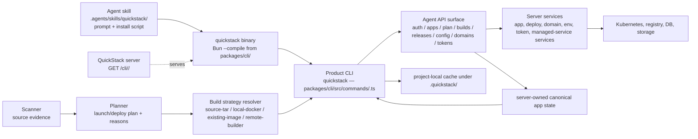

*Caption: The CLI is a typed Bun-compiled binary distributed by the server itself, so the version Nina installs always matches the server she points at. The agent skill is a thin install + prompt shim — it does not embed CLI logic. Detection feeds a validated plan, the plan picks an explicit build strategy, and canonical app state lives on the server rather than only in local cache files.*

### Key design decisions

**`quickstack` is one real CLI, packaged as a TypeScript monorepo workspace and shipped as a single binary:** picked this because the current `.mjs` script is already past the size where one file is maintainable, and a typed package gives the agent and human reviewers a stable file map. Tradeoff: monorepo workspace + Bun build pipeline added to the repo. Rejected staying on a single `.mjs` because every later phase would extend it further.

**The QuickStack server distributes the CLI binary it expects:** picked this because every QuickStack server is potentially on a different version, and the agent skill should not ship a CLI that drifts from its target server. `quickstack setup --server <url>` pulls the binary built for that server. Tradeoff: server has to host versioned binaries per platform. Rejected publishing to public npm because that decouples CLI version from server version and forces the agent skill to reason about compatibility.

**Build strategy is a first-class product concept:** picked this because fast deploys do not come from one transport. Different repos and environments should flow into source tar uploads, local Docker build/push, existing images, or remote builder paths for explicit reasons. Tradeoff: planner and backend complexity increase. Rejected a single upload-centric model because it leaves obvious fast paths outside the product.

**Backend work is encouraged, not treated as a last resort:** picked this because a flyctl-equivalent CLI requires canonical server state, rollout endpoints, token endpoints, lifecycle routes, build orchestration routes, and service composition models. Tradeoff: larger server scope. Rejected local-script-only solutions because they create more client-side guesswork and brittle state.

**Phases organize execution order, not ship checkpoints:** picked this because the work lands as one PR. Phases let the implementer (and the agent executing the work) build in dependency order with a verification gate per phase, while the human reviewer reads commits in phase order. Tradeoff: no incremental shipping value until the PR merges. Rejected slicing into N PRs because the CLI surface and server contract have to land together for the V1 acceptance gates to be meaningful.

---

## PR shape and review navigation

This RFC describes one PR. The phases below are not separate PRs, separate releases, or independent ship gates — they are the **execution order** the implementer (and any agent driving the work) follows, and the **commit boundaries** the reviewer reads in order.

**Convention for the implementer:**

- One commit per phase, in numerical order. Commit message: `phase N: <phase title>`. The PR description links each commit to the corresponding phase section in this RFC.
- The "Verification gate" at the end of each phase is the local check the implementer (or agent) runs before starting the next phase. It is **not** a CI ship gate. CI runs the V1 acceptance gates against the integrated PR.
- Later phases may extend files introduced in earlier phases. The dependency graph reflects build order, not module ownership.

**Convention for the reviewer:**

- Read commits in order; each is a coherent slice of one phase.
- Use the V1 acceptance gates as the merge criteria.
- Use the flyctl parity stance table as the scope diff against fly.io's `flyctl`.

---

## Phase 0: Stand up the CLI package, binary distribution, and skill rename

**Goal:** Move the CLI out of `.agents/skills/quickdeploy/bin/quickstack.mjs` into a typed monorepo workspace package, build it to a single binary with Bun, have the QuickStack server distribute that binary, and rename the agent skill to match. After Phase 0, the CLI behaves identically to today (`whoami`/`apps`/`launch`/`deploy`/etc. still work) but ships from the new package and the new install path.

**How it works**

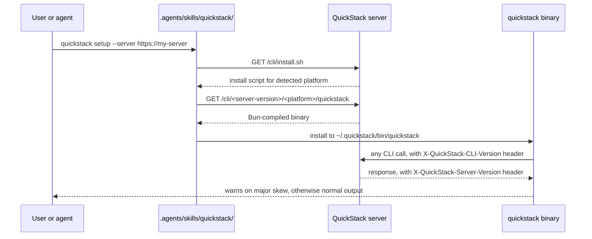

*Caption: The skill is now a shim. It runs the install script the server hosts, drops the binary the server built, and delegates everything else to that binary. CLI version always matches the server it was installed from.*

**Changes**

- `packages/cli/package.json` — new TypeScript package, `name: "@quickstack/cli"`, `bin: { quickstack: "./dist/quickstack" }`, build script `bun build src/main.ts --compile --outfile dist/quickstack`.
- `packages/cli/tsconfig.json` — strict TypeScript config, target node20, references the root tsconfig where appropriate.
- `packages/cli/src/main.ts` — entry point, command dispatch by verb name.
- `packages/cli/src/commands/<verb>.ts` — one file per top-level verb. Initial set ports today's verbs: `setup.ts`, `whoami.ts`, `apps.ts`, `launch.ts`, `deploy.ts`, `logs.ts`, `status.ts`, `releases.ts`, `secrets.ts`, `endpoints.ts`, `volumes.ts`, `exec.ts`, `scale.ts`, `rollback.ts`, `postgres.ts`, `redis.ts`. Later phases add new files to this directory rather than extending one big file.
- `packages/cli/src/lib/api-client.ts` — typed HTTP client for `/api/v1/agent/*` routes. Sends `X-QuickStack-CLI-Version` on every request.
- `packages/cli/src/lib/state.ts` — project-local cache reader/writer. Writes to `.quickstack/`, falls back to reading `.quickdeploy/` for one release.
- `packages/cli/src/lib/output.ts` — shared JSON-envelope and human-readable output helpers. Every verb returns either `{ outcome: "ok" | "question" | "error", ... }` JSON or formatted text based on `--json`.
- `packages/cli/src/lib/version.ts` — bundles the build-time CLI version string.
- `pnpm-workspace.yaml` (or equivalent) — register `packages/*` as a workspace.
- `package.json` (root) — add a top-level `build:cli` script that runs the Bun compile for each supported platform (`linux-x64`, `linux-arm64`, `darwin-x64`, `darwin-arm64`) and writes the artifacts under `public/cli/<version>/<platform>/quickstack`.
- `src/app/api/cli/install.sh/route.ts` — serves a POSIX install script that detects `uname` output, picks the right platform, downloads the binary for the running server's version, drops it under `~/.quickstack/bin/`, and writes `~/.quickstack/config.json` with the server URL.
- `src/app/api/cli/[version]/[platform]/quickstack/route.ts` — serves the binary file with appropriate headers.
- `src/server/services/cli-distribution.service.ts` — resolves the right binary path on disk for a `(version, platform)` pair and validates against an allowlist.
- `.agents/skills/quickstack/` — new skill directory (renamed from `.agents/skills/quickdeploy/`). Contents reduce to: prompt guidance and a one-line install hook that runs `curl -sSL https://<server>/cli/install.sh | sh`. Embedded `bin/quickstack.mjs` and `scripts/*.mjs` are deleted; their behavior is now in the package.
- `.agents/skills/quickdeploy/` — removed in this same commit. No code remains; the skill name is replaced wholesale.

**Verification gate**

- `pnpm install && pnpm --filter @quickstack/cli build` produces `dist/quickstack` for the host platform.
- `dist/quickstack whoami` succeeds against a local QuickStack server.
- `curl http://localhost:3000/api/cli/install.sh | sh` installs the binary to `~/.quickstack/bin/quickstack` and `quickstack whoami` works from a fresh shell.
- `pnpm exec tsc --noEmit --pretty false` passes with the new package included.
- `grep -r quickdeploy .agents/skills` returns no matches.

---

**Goal:** Give the CLI a stable identity, account/app discovery surface, and project-local state model so all later verbs operate from one consistent context.

**How it works**

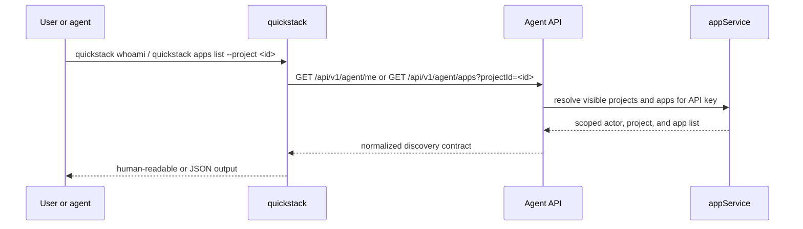

*Caption: Phase 1 is the smallest standalone improvement. Before adding more power, the CLI must reliably answer who it is acting as, what projects exist, and what apps are in scope.*

**Changes**

- `packages/cli/src/commands/whoami.ts` — new command implementing `quickstack whoami`.
- `packages/cli/src/commands/apps.ts` — new command implementing `quickstack apps list|show|open`. Centralizes app and project resolution; later command files import its resolver helpers.
- `packages/cli/src/lib/api-client.ts` — extend with typed methods for actor and app discovery.
- `packages/cli/src/lib/state.ts` — finalize `.quickstack/` write path and one-release `.quickdeploy/` read fallback (introduced in Phase 0; this phase confirms the state shape used by discovery).
- `src/app/api/v1/agent/apps/route.ts` — new route returning scoped apps for a project.
- `src/app/api/v1/agent/me/route.ts` — normalize actor/project/app discovery output for CLI use.
- `src/shared/model/agent-me.model.ts` — actor/project discovery contract.
- `src/shared/model/agent-app-list.model.ts` — app-list contract.
- `src/server/services/api-key.service.ts` — reuse allowlist filtering logic for project/app list routes.

**Verification gate**

- Unit: `src/app/api/v1/agent/me/route.unit.spec.ts` and new `src/app/api/v1/agent/apps/route.unit.spec.ts` cover scope filtering and allowlists.
- Integration: CLI output tests for `whoami`, `apps list`, and legacy `.quickdeploy/` read-compat.
- Local check: `pnpm exec tsc --noEmit --pretty false && pnpm vitest run "src/app/api/v1/agent/me/route.unit.spec.ts" "src/app/api/v1/agent/apps/route.unit.spec.ts" && pnpm --filter @quickstack/cli build`

---

## Phase 2: Port the scanner into an evidence-first planner

**Goal:** Convert source detection from hidden CLI behavior into a validated plan that explains what QuickStack inferred and what still needs user input.

**How it works**

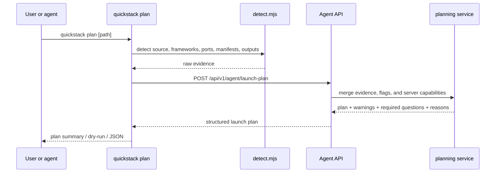

*Caption: Phase 2 makes detection legible. The scanner still runs locally, but it produces evidence that a planner turns into a normalized contract rather than a string of implicit branching decisions.*

**Changes**

- `packages/cli/src/lib/detect.ts` — port the existing `detect.mjs` scanner into the package, enriched with service-root evidence, framework/runtime evidence, port evidence, likely build entrypoints, and build strategy hints.
- `packages/cli/src/commands/plan.ts` — new `commandPlan()` plus `--plan` / `--dry-run` support in `launch.ts` and `deploy.ts`.
- `packages/cli/src/lib/api-client.ts` — add `launch-plan` typed method.
- `src/app/api/v1/agent/launch-plan/route.ts` — plan route.
- `src/server/services/quickdeploy-plan.service.ts` — planning and inference normalization.
- `src/shared/model/agent-launch-plan.model.ts` — plan, warnings, questions, build recommendations, and inference reasons.
- `src/app/api/v1/agent/apps/ensure/route.ts` — accept normalized plan output instead of only ad hoc launch payloads.

**Tests**

- Unit: `src/server/services/quickdeploy-plan.service.unit.spec.ts` covers Dockerfile, static, image, and ambiguous multi-service repos.
- Integration: `/api/v1/agent/launch-plan` route spec covers required questions and capability failures.
- Pass criterion: `pnpm exec tsc --noEmit --pretty false && pnpm vitest run "src/server/services/quickdeploy-plan.service.unit.spec.ts" "src/app/api/v1/agent/launch-plan/route.unit.spec.ts" && pnpm --filter @quickstack/cli build`

---

## Phase 3: Port the image, build, and deployer model

**Goal:** Let QuickStack choose and expose the fastest valid build path instead of treating source tar uploads as the default managed path for almost everything.

**How it works**

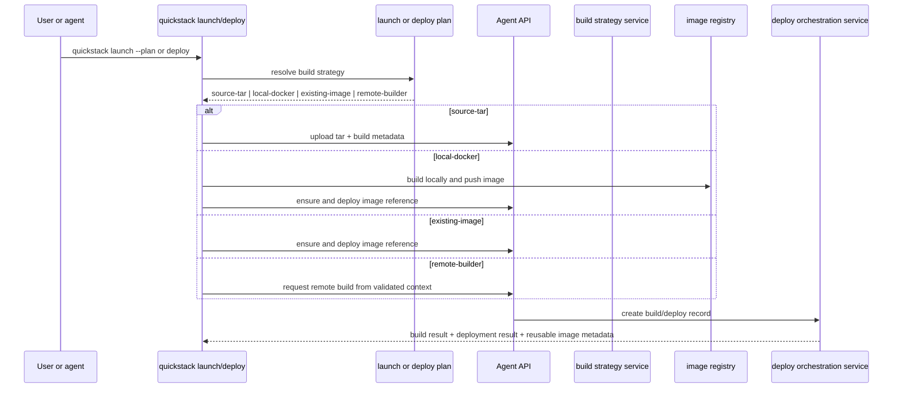

*Caption: Phase 3 is the fast-deploy phase. The scanner and planner no longer imply one transport; they select an explicit build backend and a normalized deployer contract that the CLI and server both understand.*

**Changes**

- `packages/cli/src/commands/launch.ts` and `packages/cli/src/commands/deploy.ts` — add `--build-strategy auto|source-tar|local-docker|existing-image|remote-builder`.
- `packages/cli/src/commands/build.ts` — new top-level `quickstack build` verb.
- `packages/cli/src/lib/build-strategies/{source-tar,local-docker,existing-image,remote-builder}.ts` — one file per backend executor; the resolver picks among them. Replaces the monolithic `packageManagedSource()` in the old `.mjs`.
- `packages/cli/src/lib/build-strategies/local-docker.ts` — local Docker build/push using registry credentials and existing app/image context.
- `packages/cli/src/lib/api-client.ts` — typed methods for strategy-backed build preparation and finalization.
- `src/app/api/v1/agent/apps/[appId]/upload-build/route.ts` — keep tar upload support but normalize its response into a shared build result contract.
- `src/app/api/v1/agent/apps/[appId]/builds/route.ts` — build orchestration route for local-image deploys and remote-builder launches.
- `src/app/api/v1/agent/apps/[appId]/deploy/route.ts` — extend deploy to accept normalized build/image results from any strategy.
- `src/server/services/quickdeploy-build-strategy.service.ts` — build strategy selection, cache reuse, backend capability checks.
- `src/server/services/quickdeploy-upload.service.ts` — normalize build metadata across source-tar, local-docker, existing-image, and remote-builder paths.
- `src/server/services/build.service.ts` — deepen build and release normalization.
- `src/shared/model/agent-build-strategy.model.ts` — build strategy and build result contract.

**Tests**

- Unit: `src/server/services/quickdeploy-build-strategy.service.unit.spec.ts` covers resolution, fallback, cache hits, and invalid combinations.
- Integration: route specs for tar uploads, local image deploys, remote-builder launches, and deploy result normalization.
- Manual verification: deploy one sample app with `source-tar`, one with `local-docker`, and one with `--image`, then verify repeated deploys can reuse image metadata instead of forcing new uploads.
- Pass criterion: `pnpm exec tsc --noEmit --pretty false && pnpm vitest run "src/server/services/quickdeploy-build-strategy.service.unit.spec.ts" "src/app/api/v1/agent/apps/[appId]/upload-build/route.unit.spec.ts" "src/app/api/v1/agent/apps/[appId]/builds/route.unit.spec.ts"`

---

## Phase 4: Add rollout watch, releases, logs, and operator diagnostics

**Goal:** Make deploys and builds explainable by exposing proper rollout watch, release state, streaming logs, and doctor-style diagnostics instead of polling snapshots.

**How it works**

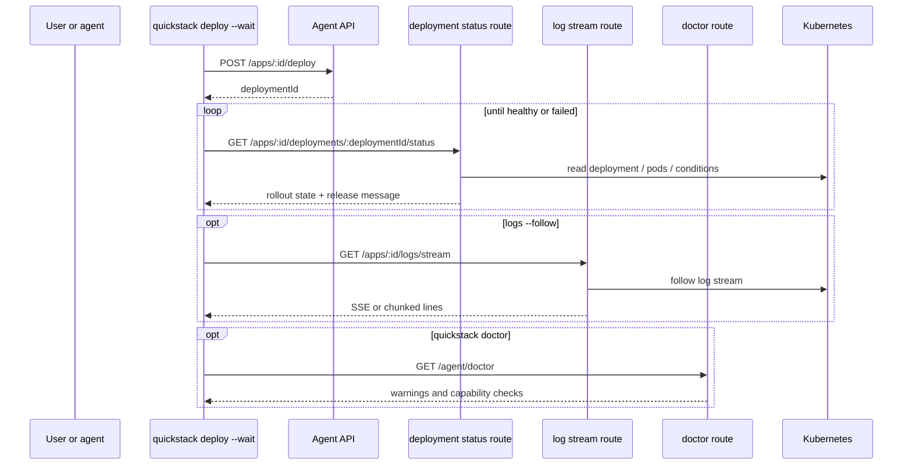

*Caption: The CLI stops treating rollout as a side effect and instead gets a first-class release/watch model plus actionable diagnostics from the server.*

**Changes**

- `packages/cli/src/commands/{deploy,status,logs,doctor}.ts` — add `--wait`, `--timeout`, `status --watch`, real `logs --follow`, and the `doctor` verb.
- `packages/cli/src/lib/api-client.ts` — add non-buffered status/log streaming support and doctor calls.
- `src/app/api/v1/agent/apps/[appId]/deployments/[deploymentId]/status/route.ts` — rollout-status route.
- `src/app/api/v1/agent/apps/[appId]/logs/stream/route.ts` — streaming logs route.
- `src/app/api/v1/agent/apps/[appId]/releases/route.ts` — extend release output with richer deploy and build context.
- `src/app/api/v1/agent/doctor/route.ts` — diagnostic route for auth, app visibility, build prerequisites, quota checks, and capability checks.
- `src/server/services/deployment-record.service.ts` — compute normalized rollout and release state.
- `src/shared/model/agent-release.model.ts` — normalized release and rollout state contract.
- `src/shared/model/agent-doctor.model.ts` — diagnostic result contract.

**Tests**

- Unit: rollout-state mapping from Kubernetes conditions to CLI states.
- Integration: route tests for deployment-status, stream setup semantics, and doctor diagnostics.
- Manual verification: `quickstack deploy --wait` exits healthy or failed correctly; `quickstack logs --follow` streams continuously without polling the full log body.
- Pass criterion: `pnpm exec tsc --noEmit --pretty false && pnpm vitest run "src/app/api/v1/agent/apps/[appId]/status/route.unit.spec.ts" "src/app/api/v1/agent/apps/[appId]/deployments/[deploymentId]/status/route.unit.spec.ts" "src/app/api/v1/agent/doctor/route.unit.spec.ts"`

---

## Phase 5: Add full app lifecycle and configuration verbs

**Goal:** Cover the day-two app operations that currently send users back to the web UI or raw APIs.

**How it works**

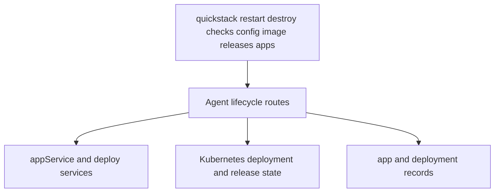

*Caption: Phase 5 makes the CLI feel like the product rather than just a launcher by covering the core lifecycle verbs users expect after the first deploy.*

**Changes**

- `packages/cli/src/commands/{restart,destroy,checks,releases,apps,image}.ts` — implement `restart`, `destroy`, `checks`, richer `releases`, `apps open`, and the `image show` / `image deploy` verbs.
- `packages/cli/src/lib/api-client.ts` — add typed methods for lifecycle verbs.
- `src/app/api/v1/agent/apps/[appId]/restart/route.ts` — restart route.
- `src/app/api/v1/agent/apps/[appId]/route.ts` — add `DELETE` support for app destroy and a canonical app-level `GET`.
- `src/app/api/v1/agent/apps/[appId]/checks/route.ts` — health-check inspection route.
- `src/app/api/v1/agent/apps/[appId]/config/route.ts` — app-level config route.
- `src/server/services/app.service.ts` — restart, destroy, config, and app lifecycle operations.

**Tests**

- Route specs for restart, destroy, checks, and app-level config.
- CLI smoke checks to ensure lifecycle verbs dispatch to live implementations.
- Pass criterion: `pnpm exec tsc --noEmit --pretty false && pnpm vitest run "src/app/api/v1/agent/apps/[appId]/restart/route.unit.spec.ts" "src/app/api/v1/agent/apps/[appId]/checks/route.unit.spec.ts" "src/app/api/v1/agent/apps/[appId]/route.unit.spec.ts" && pnpm --filter @quickstack/cli build`

---

## Phase 6: Add networking, domains, certificates, and proxy access

**Goal:** Bring the full networking surface under the CLI so users can control how apps are exposed without leaving the command line.

**How it works**

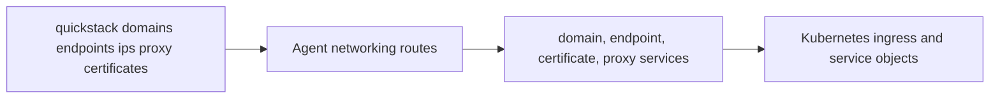

*Caption: Phase 6 rounds out exposure and access. The CLI can already touch some of these areas; this phase makes them complete enough to avoid fallback to the web UI.*

**Changes**

- `packages/cli/src/commands/{domains,endpoints,proxy,ips,certs}.ts` — deepen `domains` and `endpoints`; add `proxy`, `ips`, and `certs status` verbs.
- `packages/cli/src/lib/api-client.ts` — add networking methods.
- `src/app/api/v1/agent/apps/[appId]/domains/route.ts` — domain CRUD route.
- `src/app/api/v1/agent/apps/[appId]/endpoints/route.ts` — extend endpoint CRUD with richer metadata.
- `src/app/api/v1/agent/apps/[appId]/proxy/route.ts` — proxy route for session-backed private-service access.
- `src/shared/model/agent-domain.model.ts` and `src/shared/model/agent-endpoint.model.ts` — canonical networking contracts.
- `src/server/services/agent-domain.service.ts`, `src/server/services/certificate.service.ts`, `src/server/services/ip-inventory.service.ts`, `src/server/services/proxy-session.service.ts`, and `src/server/services/private-network.service.ts` — implement domain, certificate, endpoint, IP inventory, and proxy orchestration.

**Tests**

- Route specs for domains, endpoints, and proxy flows.
- Manual verification: add a second domain, reserve a raw endpoint, and open a local proxy to a private service.
- Pass criterion: `pnpm exec tsc --noEmit --pretty false && pnpm vitest run "src/app/api/v1/agent/apps/[appId]/domains/route.unit.spec.ts" "src/app/api/v1/agent/apps/[appId]/endpoints/route.unit.spec.ts"`

---

## Phase 7: Add volumes, runtime controls, and remote access

**Goal:** Bring storage, runtime controls, and remote-access behavior under the CLI so users can shape how apps run without leaving the command line.

**How it works**

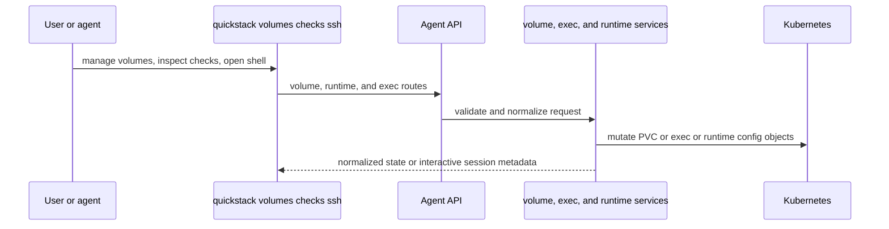

*Caption: Phase 7 makes the storage and runtime surface first-class. The product should not force users into the dashboard for volume lifecycle, health settings, or remote-access workflows.*

**Changes**

- `packages/cli/src/commands/{volumes,ssh,checks}.ts` — deepen `volumes`; add `ssh` (or `shell`) on top of streaming exec; add health-check or runtime-control subcommands where needed.
- `packages/cli/src/lib/api-client.ts` — add streaming runtime access methods for volume and exec routes.
- `src/app/api/v1/agent/apps/[appId]/volumes/route.ts` — extend volume metadata and validation surfaces.
- `src/app/api/v1/agent/apps/[appId]/checks/route.ts` — expose read or update health-check configuration if split from lifecycle/config.
- `src/app/api/v1/agent/apps/[appId]/exec/stream/route.ts` — streaming exec or shell route.
- `src/shared/model/agent-volume.model.ts` — richer volume state contract.
- `src/server/services/pvc.service.ts` and `src/server/services/pod-exec-session.service.ts` — volume lifecycle and streaming exec support.

**Tests**

- Route specs for richer volume, check, and exec-stream flows.
- Manual verification: create, update, and delete a volume; inspect runtime health settings; open a remote shell session through the CLI.
- Pass criterion: `pnpm exec tsc --noEmit --pretty false && pnpm vitest run "src/app/api/v1/agent/apps/[appId]/volumes/route.unit.spec.ts" "src/app/api/v1/agent/apps/[appId]/exec/route.unit.spec.ts"`

---

## Phase 8: Deepen managed services and app composition

**Goal:** Make managed services feel like part of the same deployment product, not just isolated side commands.

**How it works**

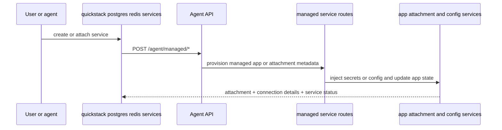

*Caption: Phase 8 turns managed databases and managed services into part of the same app-composition workflow as launch and deploy, rather than side commands with fragmented state.*

**Changes**

- `packages/cli/src/commands/{postgres,redis,mysql,services}.ts` — deepen `postgres` and `redis` with clearer attachment/status flows; add `mysql` and `services` composition verbs.
- `packages/cli/src/lib/api-client.ts` — normalize managed-service result contracts.
- `src/app/api/v1/agent/managed/postgres/route.ts` and `src/app/api/v1/agent/managed/redis/route.ts` — extend status and attachment metadata.
- `src/shared/model/agent-managed-service.model.ts` — shared managed-service contract.
- `src/server/services/quickstack-managed-service.ts`, `src/server/services/postgres.service.ts`, `src/server/services/redis.service.ts`, `src/server/services/mysql.service.ts`, and `src/server/services/service-attachment.service.ts` — deepen attachment and composition behavior so the CLI can show service state in a product-level way.

**Tests**

- Route specs for create, attach, and destroy flows with normalized output.
- Manual verification: create a managed Postgres or Redis service, attach it to an app, and confirm config pull reflects the attachment.
- Pass criterion: `pnpm exec tsc --noEmit --pretty false && pnpm vitest run "src/app/api/v1/agent/managed/postgres/route.unit.spec.ts" "src/app/api/v1/agent/managed/redis/route.unit.spec.ts"`

---

## Phase 9: Add multi-user safety, tokens, and agent ergonomics

**Goal:** Make the CLI safe and understandable on shared servers where many people and many agents are acting on the same infrastructure.

**How it works**

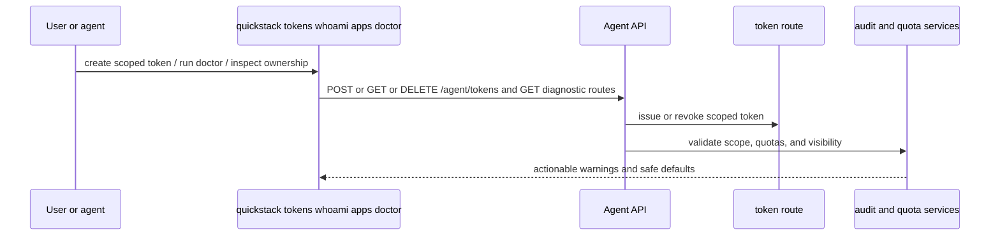

*Caption: Phase 9 makes the product fit the actual target environment: shared servers where agents need strong scopes, clear diagnostics, predictable failure messages, and explicit operational guardrails.*

**Changes**

- `packages/cli/src/commands/{tokens,doctor}.ts` — add `tokens` and extend `doctor`; add richer ownership/error messaging surfaced through `packages/cli/src/lib/output.ts`.
- `packages/cli/src/lib/api-client.ts` — add token and diagnostic methods.
- `src/app/api/v1/agent/tokens/route.ts` — token list/create/revoke route.
- `src/app/api/v1/agent/doctor/route.ts` — extend the Phase 4 doctor route with token-scope, quota, and ownership checks.
- `src/shared/model/agent-token.model.ts` — token metadata and scope contract.
- `src/shared/model/agent-doctor.model.ts` — extend with token, scope, and quota result fields.
- `src/server/services/api-key.service.ts` and any quota or audit services — implement token lifecycle and diagnostic checks for CLI use.

**Tests**

- Route specs for token CRUD and doctor diagnostics.
- CLI contract tests for clear denial/error output when API keys are out of scope.
- Pass criterion: `pnpm exec tsc --noEmit --pretty false && pnpm vitest run "src/app/api/v1/agent/tokens/route.unit.spec.ts" "src/app/api/v1/agent/doctor/route.unit.spec.ts" && pnpm --filter @quickstack/cli build`

---

## Dependency graph

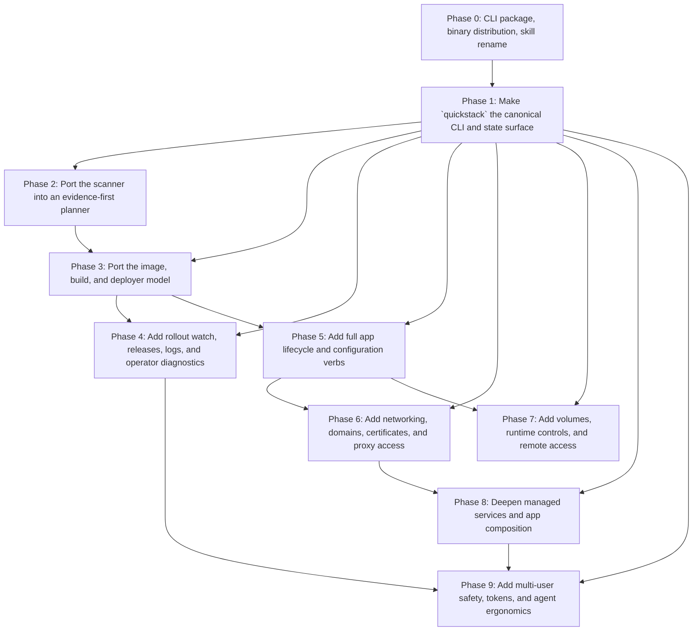

*Caption: Phase 0 is the foundation — every later phase writes into `packages/cli/` and depends on the install path. Phase 1 establishes account, app, and state context every later verb needs. Planning comes before the build and deployer model because the planner picks the backend intentionally. Build and deployer come before rollout watch and lifecycle because deploy UX should reflect the real backend in use. Managed-service composition and multi-user safety come later, once the core app lifecycle model is coherent.*

## Versioning contract

Because the QuickStack server distributes the CLI binary it expects, version skew between CLI and server is the primary failure mode worth designing for explicitly.

**Contract:**

- The CLI sends `X-QuickStack-CLI-Version: <semver>` on every request.
- The server returns `X-QuickStack-Server-Version: <semver>` on every response.
- The CLI compares the two on every call. **Major-version skew** prints a one-line warning to stderr telling the user to re-run `quickstack setup --server <url>` to update. The CLI does **not** hard-block the call — an agent in the middle of a deploy is not killed by a version warning.
- **Minor- or patch-version skew** is silent on normal calls.
- `quickstack doctor` upgrades any detected skew to actionable output: which CLI version is installed, which server version it's talking to, and the exact command to reinstall.
- `quickstack setup --server <url>` always pulls the binary the target server publishes for its own version. Switching servers is the same flow as first install.

**Server-side responsibilities:**

- The server publishes binaries for `linux-x64`, `linux-arm64`, `darwin-x64`, and `darwin-arm64` under `GET /api/cli/<version>/<platform>/quickstack`.
- The install script at `GET /api/cli/install.sh` detects the platform, fetches the binary for the running server's own version, and writes `~/.quickstack/config.json` with the server URL.
- The `cli-distribution.service.ts` validates `<version>` and `<platform>` against an allowlist before serving any file.

**Why soft-warning over hard-block:** the most common skew case is "Nina updated the server but hasn't re-run setup on her laptop." Hard-blocking turns that into a stop-the-world incident; soft-warning lets the call proceed and surfaces the fix in the next `doctor` invocation. Major-version bumps are the only case where we expect on-wire incompatibility, and the warning is unambiguous about the fix.

## Test structure

### Layers

- **Unit** — planner logic, build-strategy resolution, route authorization branches, rollout-state mapping, env/config reconciliation code paths, and token-service logic with dependencies mocked.
- **Integration** — agent API routes under `src/app/api/v1/agent/**` using mocked service layers or adapter seams, plus route-unit specs that exercise auth, payload validation, response shape, build strategy selection, and lifecycle behavior.
- **CLI contract** — `quickstack.mjs` command parsing, JSON envelopes, question output, help surface, and build-path selection with controlled `quickstack-api.mjs` responses.
- **Manual conformance** — a real sample app deployed through `quickstack plan`, `launch`, `deploy --wait`, `logs --follow`, `domains`, `config pull`, managed-service attach flows, and at least two different build strategies against a live QuickStack environment.

### Local verification

```sh
pnpm exec tsc --noEmit --pretty false
pnpm vitest run "src/app/api/v1/agent/**/*.unit.spec.ts"
node --check ".agents/skills/quickstack/install.sh" 2>/dev/null || true
pnpm --filter @quickstack/cli build
```

### CI additions

- Route-spec coverage for every new `/api/v1/agent/` endpoint added in this spec.
- CLI contract tests that snapshot `--json` envelopes for new verbs (`whoami`, `apps list`, `plan`, `restart`, `destroy`, `domains`, `checks`, `config pull`, `tokens`, `doctor`) and build strategies (`source-tar`, `local-docker`, `existing-image`, `remote-builder`).
- At least one deploy-watch integration test that proves `--wait` exits healthy on success and non-zero on rollout failure.
- At least one build-path integration test that proves unchanged inputs can reuse an already-pushed image rather than forcing a fresh tar upload.

### Test harness notes

- Reuse the agent route-unit-spec pattern already used by `src/app/api/v1/agent/apps/[appId]/exec/route.unit.spec.ts` and `src/app/api/v1/agent/apps/[appId]/volumes/route.unit.spec.ts`.
- Add a shared route-test assertion utility for checking that a `Response` is present before reading `.status` or `.json()`, so TypeScript narrowing stays explicit in subsequent route specs.
- Keep CLI tests at the command-envelope level instead of mocking every internal utility independently; the user-facing contract is the more important thing to pin.

## flyctl parity stance

`flyctl` is the explicit reference. Each row below names a flyctl command family and pins QuickStack's stance: which `quickstack` verbs cover it, the route/model/service anchors that implement it, and the executable v1 gate that proves it works. The "v1 non-goal" subsection lists families we explicitly do not ship as v1 verbs and what covers the underlying need instead.

| flyctl command family | QuickStack command surface | Route / model / service anchors | Executable v1 gate |
|---|---|---|---|
| `apps` | `quickstack apps list`, `quickstack apps show`, `quickstack apps open` | `GET /api/v1/agent/apps`, `src/shared/model/agent-app-list.model.ts`, `src/server/services/app.service.ts` | `quickstack apps list --project <id>` returns scoped apps |
| `auth` | `quickstack setup`, `quickstack whoami` | `GET /api/v1/agent/me`, `src/shared/model/agent-me.model.ts`, `src/server/services/api-key.service.ts` | `quickstack whoami` returns the current actor and visible projects |
| `tokens` | `quickstack tokens list|create|revoke` | `GET/POST/DELETE /api/v1/agent/tokens`, `src/shared/model/agent-token.model.ts`, `src/server/services/api-key.service.ts` | `quickstack tokens list` shows the tokens created by `quickstack tokens create` |
| `launch` | `quickstack launch`, `quickstack launch --plan` | `POST /api/v1/agent/launch-plan`, `POST /api/v1/agent/apps/ensure`, `src/server/services/quickdeploy-plan.service.ts` | `quickstack launch --plan <path>` prints a normalized launch plan |
| `detect` | `quickstack detect` | `src/shared/model/agent-launch-plan.model.ts`, `src/server/services/quickdeploy-plan.service.ts` | `quickstack detect <path>` emits scanner evidence for that repo |
| `image` | `quickstack image show`, `quickstack image deploy` | `POST /api/v1/agent/apps/[appId]/deploy`, `src/shared/model/agent-build-strategy.model.ts`, `src/server/services/build.service.ts` | `quickstack image show <app>` returns the live image reference |
| `build` | `quickstack build`, `quickstack launch --build-strategy ...`, `quickstack deploy --build-strategy ...` | `POST /api/v1/agent/apps/[appId]/builds`, `POST /api/v1/agent/apps/[appId]/upload-build`, `src/server/services/quickdeploy-build-strategy.service.ts` | `quickstack build <path> --build-strategy local-docker` produces a normalized build result |
| `deploy` | `quickstack deploy`, `quickstack deploy --wait` | `POST /api/v1/agent/apps/[appId]/deploy`, `GET /api/v1/agent/apps/[appId]/deployments/[deploymentId]/status`, `src/server/services/deployment-record.service.ts` | `quickstack deploy <path> --wait` exits on rollout success or failure |
| `releases` | `quickstack releases`, `quickstack releases show <release>` | `GET /api/v1/agent/apps/[appId]/releases`, `src/shared/model/agent-release.model.ts`, `src/server/services/deployment-record.service.ts` | `quickstack releases <app>` returns release history |
| `logs` | `quickstack logs`, `quickstack logs --follow` | `GET /api/v1/agent/apps/[appId]/logs`, `GET /api/v1/agent/apps/[appId]/logs/stream`, `src/shared/model/agent-log-event.model.ts`, `src/server/services/log-stream.service.ts` | `quickstack logs <app> --follow` streams logs without polling full snapshots |
| `status` | `quickstack status`, `quickstack status --watch` | `GET /api/v1/agent/apps/[appId]/status`, `GET /api/v1/agent/apps/[appId]/deployments/[deploymentId]/status`, `src/shared/model/agent-release.model.ts` | `quickstack status <app> --watch` updates rollout state continuously |
| `metrics` | `quickstack metrics <app>` | `GET /api/v1/agent/apps/[appId]/metrics`, `src/shared/model/agent-metrics-summary.model.ts`, `src/server/services/metrics.service.ts` | `quickstack metrics <app>` returns CPU, memory, replica, and rollout summaries |
| `doctor` | `quickstack doctor`, `quickstack doctor <app>` | `GET /api/v1/agent/doctor`, `src/shared/model/agent-doctor.model.ts`, `src/server/services/doctor.service.ts` | `quickstack doctor <app>` returns capability and remediation checks |
| `checks` | `quickstack checks list <app>` | `GET /api/v1/agent/apps/[appId]/checks`, `src/shared/model/agent-check.model.ts`, `src/server/services/health-check.service.ts` | `quickstack checks list <app>` returns health-check state |
| `secrets` | `quickstack secrets list|set|unset|import|sync|diff` | `GET/POST /api/v1/agent/apps/[appId]/secrets`, `src/server/services/app-config.service.ts`, `src/shared/model/agent-secret-state.model.ts` | `quickstack secrets list <app>` returns secret names and sync metadata |
| `env` | `quickstack env list|set|unset|sync` | `GET/POST/DELETE /api/v1/agent/apps/[appId]/env`, `src/shared/model/agent-env.model.ts`, `src/server/services/app-config.service.ts` | `quickstack env list <app>` returns public env state |
| `config` | `quickstack config show|pull|validate|repair` | `GET /api/v1/agent/apps/[appId]/config`, `src/shared/model/agent-app-config.model.ts`, `src/server/services/app-config.service.ts` | `quickstack config pull <app>` reconstructs local state from server truth |
| `domains` | `quickstack domains list|add|remove` | `GET/POST/DELETE /api/v1/agent/apps/[appId]/domains`, `src/shared/model/agent-domain.model.ts`, `src/server/services/agent-domain.service.ts` | `quickstack domains list <app>` matches the domains shown in the UI |
| `certificates` | `quickstack certs status <app>` | `GET /api/v1/agent/apps/[appId]/certs`, `src/shared/model/agent-cert-status.model.ts`, `src/server/services/certificate.service.ts` | `quickstack certs status <app>` returns certificate readiness |
| `ips` | `quickstack ips list <app>` | `GET /api/v1/agent/apps/[appId]/ips`, `src/shared/model/agent-ip.model.ts`, `src/server/services/ip-inventory.service.ts` | `quickstack ips list <app>` returns public address inventory |
| `proxy` | `quickstack proxy 5433:5432 <app>.internal` | `POST /api/v1/agent/apps/[appId]/proxy`, `DELETE /api/v1/agent/apps/[appId]/proxy`, `src/shared/model/agent-proxy-session.model.ts`, `src/server/services/proxy-session.service.ts` | `quickstack proxy 5433:5432 <app>.internal` opens a tracked proxy session |
| `ssh` | `quickstack ssh <app>` or `quickstack shell <app>` | `WS /api/v1/agent/apps/[appId]/exec/stream`, `src/shared/model/agent-shell-session.model.ts`, `src/server/services/pod-exec-session.service.ts` | `quickstack ssh <app>` opens an interactive shell session |
| `volumes` | `quickstack volumes list|create|update|destroy|show` | `GET/POST/DELETE /api/v1/agent/apps/[appId]/volumes`, `src/shared/model/agent-volume.model.ts`, `src/server/services/pvc.service.ts` | `quickstack volumes list <app>` returns normalized volume state |
| `storage` | `quickstack storage show <app>`, `quickstack storage snapshots <app>` | `GET /api/v1/agent/apps/[appId]/storage`, `GET /api/v1/agent/apps/[appId]/storage/snapshots`, `src/shared/model/agent-volume.model.ts`, `src/server/services/storage-state.service.ts` | `quickstack storage show <app>` returns storage state |
| `postgres` | `quickstack postgres create|list|attach|destroy|status` | `GET/POST/DELETE /api/v1/agent/managed/postgres`, `src/shared/model/agent-managed-service.model.ts`, `src/server/services/postgres.service.ts` | `quickstack postgres status <service>` returns normalized service state |
| `redis` | `quickstack redis create|list|attach|destroy|status` | `GET/POST/DELETE /api/v1/agent/managed/redis`, `src/shared/model/agent-managed-service.model.ts`, `src/server/services/redis.service.ts` | `quickstack redis status <service>` returns normalized service state |
| `mysql` | `quickstack mysql create|list|attach|destroy|status` | `GET/POST/DELETE /api/v1/agent/managed/mysql`, `src/shared/model/agent-managed-service.model.ts`, `src/server/services/mysql.service.ts` | `quickstack mysql status <service>` returns normalized service state |
| `services` | `quickstack services list|attach|detach|status` | `GET /api/v1/agent/managed/services`, `POST /api/v1/agent/managed/services/attach`, `POST /api/v1/agent/managed/services/detach`, `src/shared/model/agent-service-attachment.model.ts`, `src/server/services/service-attachment.service.ts` | `quickstack services list <app>` returns attachment state |
| `jobs` | `quickstack jobs run|list|show|cancel` | `POST /api/v1/agent/apps/[appId]/jobs`, `GET /api/v1/agent/apps/[appId]/jobs`, `GET /api/v1/agent/apps/[appId]/jobs/[jobId]`, `DELETE /api/v1/agent/apps/[appId]/jobs/[jobId]`, `src/shared/model/agent-job.model.ts`, `src/server/services/job.service.ts` | `quickstack jobs list <app>` returns tracked job state |
| `scale` | `quickstack scale <app> --replicas <n>` | `POST /api/v1/agent/apps/[appId]/scale`, `src/server/services/lifecycle-action.service.ts`, `src/shared/model/agent-lifecycle-action.model.ts` | `quickstack scale <app> --replicas <n>` updates replica state |
| `restart` | `quickstack restart <app>` | `POST /api/v1/agent/apps/[appId]/restart`, `src/server/services/lifecycle-action.service.ts`, `src/shared/model/agent-lifecycle-action.model.ts` | `quickstack restart <app>` reports restart completion |
| `suspend` | `quickstack suspend <app>` | `POST /api/v1/agent/apps/[appId]/suspend`, `src/server/services/lifecycle-action.service.ts`, `src/shared/model/agent-lifecycle-action.model.ts` | `quickstack suspend <app>` reports suspended state |
| `resume` | `quickstack resume <app>` | `POST /api/v1/agent/apps/[appId]/resume`, `src/server/services/lifecycle-action.service.ts`, `src/shared/model/agent-lifecycle-action.model.ts` | `quickstack resume <app>` reports resumed state |
| `destroy` | `quickstack destroy <app>` | `DELETE /api/v1/agent/apps/[appId]`, `src/server/services/lifecycle-action.service.ts`, `src/server/services/app.service.ts` | `quickstack destroy <app>` removes the app |
| `version` | `quickstack version` | local CLI version command, no agent API route required | `quickstack version` prints CLI version |
| `mpg` | covered by `quickstack postgres ...` | `GET/POST/DELETE /api/v1/agent/managed/postgres`, `src/server/services/postgres.service.ts`, `src/shared/model/agent-managed-service.model.ts` | `quickstack postgres list` returns managed Postgres inventory |

### v1 non-goal command families

These flyctl families are explicitly **not** v1 verbs. `quickstack help` does not advertise them. The "covered by" column names the v1 verbs that handle the underlying need.

| flyctl family | Covered by | Notes |
|---|---|---|
| `sftp` | `quickstack ssh`, `quickstack proxy` | exec stream + proxy session cover the file-access path |
| `wireguard` | `quickstack proxy`, `quickstack ssh`, `quickstack network show` | private network stays a transport, not a user-facing family |
| `machine` | `quickstack scale|restart|suspend|resume|destroy` | runtime controls only, no raw machine surface |
| `orgs` | `quickstack whoami`, `quickstack apps list --project <id>` | project-scoped discovery replaces orgs |
| `settings` | `quickstack config`, `quickstack tokens`, `quickstack doctor` | settings split across operator-facing verbs |
| `synthetics` | `quickstack doctor`, `quickstack metrics` | doctor + metrics cover minimum observability |
| `mcp` | agent skill | agent skill is the integration layer |
| `extensions` | `quickstack services` and managed-service families | service composition handles supported extensions |
| `lfsc` | app, volume, and service surfaces | only where QuickStack has a native equivalent |
| `incidents` | `quickstack releases|logs|status|metrics|doctor` | release and diagnostic verbs cover the operator path |
| `consul` | managed services, config | service discovery exposed through managed services |
| `platform` | `quickstack doctor`, `quickstack whoami` | platform admin stays out of the app-centric v1 CLI |

## Scanner, build, and deployer porting plan

### Scanner port

The scanner port should preserve the shape of a mature source scanner while making the output QuickStack-native. The scanner should emit evidence, not mutate state.

Required scanner behaviors:

- runtime and framework family detection, including version hints where the repo structure makes that safe
- Dockerfile detection, including explicit Dockerfile override support
- static output detection (`dist`, `build`, `out`, and framework-specific outputs)
- service-root detection for monorepos and multi-package repos
- port detection from Dockerfile, framework defaults, manifests, and explicit config files
- database or service-desire hints when the app layout strongly implies a dependency on managed Postgres or Redis
- builder or packer hints when the source shape strongly suggests one backend over another
- evidence output for every inference so humans and agents can relay why the planner picked something

Required scanner outputs:

- scanner family and framework
- service root
- evidence list with source path and reason
- likely build entrypoint(s)
- likely output directory
- raw endpoint candidates
- recommended build strategies in priority order
- required follow-up questions when the scanner cannot safely distinguish multiple app roots or exposure models

The QuickStack-native rule is that the scanner never deploys and never creates server resources. It only emits evidence.

### Build model port

QuickStack should port the idea that build strategy is explicit and selectable, not hidden behind one default path.

Required build strategies:

- `source-tar` — current managed source upload path
- `local-docker` — local Docker build and registry push with reusable image metadata
- `existing-image` — no build; deploy an image directly
- `remote-builder` — server-backed build from validated context

Required build features across those strategies:

- explicit build args and build secret support
- Dockerfile override support
- target-stage selection when a Dockerfile defines multiple targets
- cache-aware repeated deploy behavior
- normalized build result contract regardless of backend
- consistent image provenance and content-hash tracking
- consistent release metadata so later `status`, `releases`, and `rollback` flows do not care how the image was produced

Every build path must emit the same normalized build result contract so later deploy, release, and status flows do not care how the image was produced.

### Deployer port

QuickStack should port the idea that deploy is a distinct product layer, not just the last line of the build flow.

Required deployer behaviors:

- explicit deployment ids and release ids
- release records regardless of whether the build came from source upload, local Docker, remote builder, or existing image
- wait/watch support with rollout-state transitions
- structured warnings when a strategy cannot satisfy a requested deploy mode
- normalized deploy summaries usable by both humans and agents
- strategy-aware deploy messages that explain whether a deploy reused an image, rebuilt locally, or delegated to a remote builder
- rollback records that appear in the same release history as forward deploys

## Quicklaunch and quickdeploy removal plan

The product should not expose multiple overlapping deployment CLIs.

1. **Stop using quicklaunch or quickdeploy as product-facing CLI names.**
   User-facing docs, examples, install flows, and screenshots point only to `quickstack`.

2. **Keep the agent skill as the installable automation layer.**
   The skill may keep an internal package path during migration, but it is described as the QuickStack agent skill, not as a separate deploy product.

3. **Rename project-local state from `.quickdeploy/` to `.quickstack/`.**
   For one compatibility cycle, the CLI reads both and writes only `.quickstack/`.

4. **Remove wrapper-oriented command copy.**
   `launch` remains a subcommand, not a separate tool identity.

5. **Retire old slash-command naming in user-facing docs.**
   Any `/quickdeploy` or `/quickstack` copy is reframed as agent-skill invocation of the `quickstack` CLI rather than a separate CLI product.

6. **Keep legacy compatibility only where it prevents breakage.**
   Temporary aliases may remain, but they must route directly into `quickstack` and must not branch into different product logic.

7. **Move implementation ownership toward CLI-first flows.**
   Normal deployment paths should live in the CLI plus agent API surface, not in skill instructions that duplicate deploy logic.

8. **Remove duplicated product terminology from help and docs.**
   The CLI help, skill docs, and dashboard copy should describe one deploy product and one operator mental model.

## Backend route, model, and service inventory

### Route inventory

| Route family | Current routes | New or extended routes needed | Purpose |
|---|---|---|---|
| Actor and app discovery | `GET /api/v1/agent/me` | `GET /api/v1/agent/apps`, extend `/me` | scoped actor, project, and app discovery |
| Planning | none | `POST /api/v1/agent/launch-plan` | scanner evidence to normalized plan |
| Build orchestration | `POST /api/v1/agent/apps/[appId]/upload-build` | `POST /api/v1/agent/apps/[appId]/builds`, extend upload-build | non-tar build strategies and normalized build results |
| Deploy and releases | `POST /api/v1/agent/apps/[appId]/deploy`, `GET /api/v1/agent/apps/[appId]/releases`, `POST /api/v1/agent/apps/[appId]/rollback` | extend deploy and releases, add deploy-status | release-aware deployment lifecycle |
| Status and diagnostics | `GET /api/v1/agent/apps/[appId]/status` | `GET /api/v1/agent/apps/[appId]/deployments/[deploymentId]/status`, `GET /api/v1/agent/doctor` | rollout watch and operator diagnostics |
| Logs | `GET /api/v1/agent/apps/[appId]/logs` | `GET /api/v1/agent/apps/[appId]/logs/stream` | real streaming log follow |
| Lifecycle | `POST /api/v1/agent/apps/[appId]/scale`, `POST /api/v1/agent/apps/[appId]/rollback` | `POST /restart`, `DELETE /apps/[appId]`, `POST /suspend`, `POST /resume`, jobs routes | full app lifecycle |
| Config and env | none aggregate, secrets route exists | `GET /config`, `GET/POST/DELETE /env`, extend `/secrets` | canonical config pull and full env management |
| Domains and endpoints | `GET/POST/DELETE /apps/[appId]/endpoints` | `GET/POST/DELETE /apps/[appId]/domains`, extend endpoints, add `GET /ips` | domain, certificate, and raw endpoint management |
| Proxy and runtime access | `POST /apps/[appId]/exec` | `POST /proxy`, `DELETE /proxy`, `GET /network`, `WS /exec/stream` | proxy and interactive runtime access |
| Volumes and runtime config | `GET/POST/DELETE /apps/[appId]/volumes` | extend volumes, checks route, runtime config read surface | storage and runtime control surfaces |
| Managed services | `GET/POST/DELETE /api/v1/agent/managed/postgres`, same for redis | postgres, redis, mysql, and services composition routes | service composition and attachment state |
| Tokens | none | `GET/POST/DELETE /api/v1/agent/tokens` | token lifecycle |

### Shared model inventory

| Model file | Purpose | Phase |
|---|---|---|
| `src/shared/model/agent-me.model.ts` | Actor and project context | 1 |
| `src/shared/model/agent-app-list.model.ts` | App discovery list | 1 |
| `src/shared/model/agent-launch-plan.model.ts` | Scanner/planner contract | 2 |
| `src/shared/model/agent-build-strategy.model.ts` | Build strategy and build result contract | 3 |
| `src/shared/model/agent-release.model.ts` | Normalized release and rollout state | 4 |
| `src/shared/model/agent-doctor.model.ts` | Diagnostic warnings and capabilities | 4 / 9 |
| `src/shared/model/agent-app-config.model.ts` | Canonical app config pull | 6 |
| `src/shared/model/agent-env.model.ts` | Public env contract | 6 |
| `src/shared/model/agent-domain.model.ts` | Domain and certificate state | 7 |
| `src/shared/model/agent-endpoint.model.ts` | Raw endpoint state | 7 |
| `src/shared/model/agent-volume.model.ts` | Richer volume state | 7 |
| `src/shared/model/agent-managed-service.model.ts` | Managed service attachment and status | 8 |
| `src/shared/model/agent-token.model.ts` | Token metadata and scope | 9 |

### Service inventory

| Service file | Current role | New or extended role | Phase |
|---|---|---|---|
| `src/server/services/api-key.service.ts` | auth, scope, allowlist checks | token lifecycle, richer actor discovery, CLI diagnostics | 1, 9 |
| `src/server/services/app.service.ts` | app lookup and some app mutations | restart, destroy, config aggregation, env support, domain-linked state | 5, 6, 7 |
| `src/server/services/quickdeploy-plan.service.ts` | none | planning and inference normalization | 2 |
| `src/server/services/quickdeploy-build-strategy.service.ts` | none | build strategy selection, cache reuse, backend capability checks | 3 |
| `src/server/services/quickdeploy-upload.service.ts` | source upload path | normalized build metadata across all strategies | 3 |
| `src/server/services/build.service.ts` | build orchestration | strategy-aware build and release normalization | 3, 4 |
| `src/server/services/deployment-record.service.ts` | deployment records | rollout and release state model | 4 |
| `src/server/services/agent-domain.service.ts` | domain logic | domain CRUD, certificate state, endpoint exposure | 7 |
| `src/server/services/pvc.service.ts` | volume or PVC logic | richer volume and storage state for CLI consumption | 7 |
| `src/server/services/quickstack-managed-service.ts` | managed service orchestration | deeper composition and attachment state | 8 |
| `src/server/services/pod-exec-session.service.ts` | one-shot exec support | streaming exec, proxy, or session support | 7 |

## Agent-skill contract

The installable agent skill is not a second product surface. Its job is to make agents good at using `quickstack`.

The skill contract is:

1. **The skill invokes `quickstack`, not raw agent API routes, for normal operations.**
   Raw API calls are allowed only for CLI debugging, route validation, or explicit fallback paths during development.

2. **The skill prefers `--json` and relays structured questions exactly.**
   If `quickstack` returns `outcome: "question"`, the skill asks that exact question instead of inventing deployment logic.

3. **The skill uses `quickstack plan` before mutating ambiguous repos.**
   It does not guess build strategy, service root, network exposure, or managed service attachment when the planner can answer or ask directly.

4. **The skill uses the same lifecycle verbs humans use.**
   Deploy, status, logs, restart, destroy, domains, secrets, config, tokens, and doctor all flow through the public CLI surface.

5. **The skill writes global credentials only to `~/.quickstack/config.json`.**
   It does not stash credentials in project files or local project cache.

6. **The skill treats `.quickstack/` as cache, not source of truth.**
   If local state is stale or missing, it runs `quickstack config pull`, discovery commands, or planner flows instead of guessing.

7. **The skill defaults to trustworthy operator flows.**
   For example: `deploy --wait` for user-facing deploys, `logs --follow` for troubleshooting, and `doctor` for environment diagnosis.

8. **The skill must be installable independently of the CLI release cadence.**
   It can evolve prompt guidance and agent behavior without redefining the product CLI surface.

## V1 acceptance gates

QuickStack reaches the target v1 only when all of the following are true.

### Gate 1 — Single-command product

- A new user can install `quickstack`, authenticate, and discover their projects and apps without using a second CLI surface.
- The installable agent skill uses `quickstack` directly for all normal deploy and lifecycle operations.
- User-facing docs and setup flows describe one deploy CLI and one agent skill.

### Gate 2 — Scanner and plan quality

- `quickstack plan` explains what was detected, what build strategy will be used, and which choices still require input.
- Ambiguous repos produce structured questions instead of silent guesses.
- The planner can explain why it chose source upload, local Docker, existing image, or remote builder.

### Gate 3 — Build and deploy flexibility

- The CLI can deploy through at least `source-tar`, `local-docker`, and `existing-image` strategies.
- Repeated deploys can reuse prior image or build metadata when inputs are unchanged.
- Release state is recorded consistently regardless of build strategy.
- Deploy output tells the operator which backend was used.

### Gate 4 — Lifecycle completeness

- The CLI supports app discovery, restart, destroy, releases, checks, logs, status watch, domains, endpoints, volumes, and managed Postgres/Redis without requiring the web UI.
- A user can recover from a stale local cache using `config pull` or `doctor` rather than manual operator intervention.

### Gate 5 — Config truth

- `config pull` can reconstruct canonical app state from the server.
- Public envs and secrets can both be listed, diffed, and updated through product verbs.
- The local cache can be repaired without re-running first-launch flows.

### Gate 6 — Shared-server safety

- Users can issue scoped tokens for agents.
- `doctor` can explain missing scope, missing capability, misconfiguration, or unsupported build paths in actionable terms.
- A friend using an agent can deploy and operate an app quickly without needing operator-only tribal knowledge.

### Gate 7 — Real operator confidence

- A trusted tester can go from install to first deploy to restart, logs, domain management, and service attachment entirely through `quickstack`.
- The same tester can return from a different machine and recover context through discovery and config pull.
- The tester never has to infer hidden deploy state from implementation details or debug why the CLI silently chose the wrong backend.

## Out of scope

The following are explicitly **not** part of v1 and will not be addressed by any phase in this RFC:

- **A second product-facing CLI.** Only `quickstack` ships. Legacy `quicklaunch` / `quickdeploy` names are removed from user-facing surfaces, and the agent skill directory is renamed `.agents/skills/quickstack/` in Phase 0.
- **Direct exposure of the flyctl families listed in the v1 non-goal table** (`sftp`, `wireguard`, `machine`, `orgs`, `settings`, `synthetics`, `mcp`, `extensions`, `lfsc`, `incidents`, `consul`, `platform`).
- **Multi-tenant billing, quotas as a product surface, or org administration.** Quota signals appear in `doctor`, but quota configuration is platform-side.
- **Cross-server federation, multi-region orchestration, or cluster admin verbs.** v1 targets one shared QuickStack server.
- **A WebSocket or push transport for app discovery, releases, or status.** Streaming is limited to logs and exec; everything else is request/response.
- **A plugin or extension SDK for third-party CLI verbs.** The agent skill is the only sanctioned extension surface.
- **Backwards-compatible behavior beyond one release for `.quickdeploy/` cache reads.** After that window, legacy state is ignored.
- **GUI-driven setup flows that bypass the CLI.** The web UI consumes the same agent API contracts; it is not a separate setup path.
- **Hard-blocking on CLI/server version skew.** The contract is soft warning + `doctor` remediation; we explicitly do not refuse calls based on version mismatch.
- **Publishing the CLI to public npm or another external registry.** Distribution is server-hosted only; the agent skill never reasons about external package versions.
- **Splitting the work into multiple PRs.** This RFC is delivered as one PR with phase-ordered commits.
